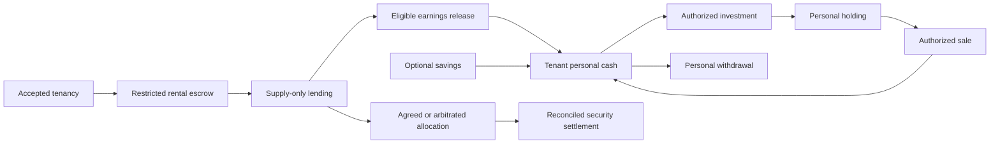

# Ledger of Life

## For judges

Ledger of Life combines Home and Money workflows with source-linked city information, native discussions and account-based opinion polls.
Rental security stays separate from personal holdings, fictional local stakes, paid AI and civic opinions.

**Live test app: <https://ledger.stadtstack.eu>.** [Revision 40](docs/DEPLOYMENT.md), released 10 October, provides direct Kontakt · Impressum · Datenschutz links. [Footer evidence](docs/evidence/HOSTED_LEGAL_FOOTER_2026-10-10.json) preserves the initial authenticated mobile failure and the corrected 1280/390 acceptance with the wallet iframe present, plus a finalized tiny house buy.

[Label acceptance](docs/evidence/HOSTED_LOYALTY_TEST_LABELS_2026-10-10.json) separates browser-local test-shop fixtures from actual production data. [Core source evidence](docs/evidence/HOSTED_CORE_SOURCES_2026-10-10.json) retains the real historical lake answer, three live source DTOs and preserved budget-answer failures; corrected two-year hosted inference still requires its real quota-window replay. Earlier loyalty, council and native opinion-poll evidence retains its own dates. Solana devnet remains the primary new-action path; earlier Robinhood Chain testnet agreements and positions remain accessible.

Broader automated account/civic/agreement purges and the new political-opinion consent checkbox are owner-paused backlog, **not deployed**. This does not remove the existing AI-desk text cleanup.

- **Rental escrow, pull-v2:** [`DuFehTh7HJVxTmBhdJiDxsDrd6xXMnQW35jzLPxBeDfb`](https://explorer.solana.com/address/DuFehTh7HJVxTmBhdJiDxsDrd6xXMnQW35jzLPxBeDfb?cluster=devnet), for bounded rental-security custody and consent/arbitration settlement.

- **House program:** [`CWUN8LKoKNEBJ6SQAVAqDFrb3rDP7vbVXMcf2EoAqjQM`](https://explorer.solana.com/address/CWUN8LKoKNEBJ6SQAVAqDFrb3rDP7vbVXMcf2EoAqjQM?cluster=devnet), deployed and initialized for `tHOME` and `tWORK`, with on-chain bytes verified in [5 October deployment evidence](docs/evidence/SOLANA_HOUSE_DEVNET_DEPLOYMENT_2026-10-05.json). Revenue is **streamed to stakers over 7 days**, not paid instantly.
- **Shares program:** [`97j5CWWKUALG2XRUBoZ1spqtN5YWJPVdTiRLNN5CWYkQ`](https://explorer.solana.com/address/97j5CWWKUALG2XRUBoZ1spqtN5YWJPVdTiRLNN5CWYkQ?cluster=devnet), deployed and initialized for test-TSLA security and lending. [Deployment evidence](docs/evidence/SOLANA_SHARES_DEVNET_DEPLOYMENT_2026-10-05.json) records finalized receipts and verified on-chain program hashes. App actions require the reviewed manifest and hosted sponsor; deployment alone is not a hosted-flow proof.
- **Hosted evidence:** [5 October run](docs/evidence/HOSTED_SOLANA_RUN_2026-10-05.json) records cash-deposit funding, one-signature rent, buy/stake/accrued claim, the full lending cycle and completed three-person Solana share-deposit settlement. Real owner-GPU paid answers were proven on revisions 30 and 32: revision 32 settled **41 output tokens / 0.0041 tUSDC**, after the reviewed 0.0128 tUSDC maximum. Earlier expired requests are preserved as failures, not successes. The local fixture's synthetic answer is separate. Availability depends on the host; unused delegated allowance is not another payment and is not automatically revoked.
- **Try with a passkey:** open the live hostname in a passkey-capable browser, create an account and register a passkey (no real identity document required for test accounts). In **Money → Holdings → Get test money**, request site tUSDC. In **Money → Local stakes**, select House or Workshop, review and sign a buy, then stake; claim appears as the stream accrues. Home's full tenancy journey needs separate landlord, tenant and assigned arbitrator accounts. Review the exact amount, recipient, network and effects before every signature, then open the result's Solana Explorer receipt with `?cluster=devnet`. Availability depends on configured manifests and sponsor capacity; deployment evidence alone is not a hosted-flow proof.
- **Fast path, no account:** inspect the recorded Solana receipts below. `/replay` and `/story` retain dated Robinhood receipts, not proof of the new Solana flows. For a full live tenancy use three separate browser profiles/accounts: landlord, tenant and assigned arbitrator; publish/apply/select/join/accept before escrow setup/funding. Monthly rent is separate from the protected deposit. Configured embedded-wallet/sponsored flows need no seed phrase or SOL purchase, but still depend on passkey support, provider, RPC and sponsor availability.
- **Native city flow:** in **Places → Have your say**, choose a discussion city, create a topic, add discussion and pro/con arguments, inspect the same hierarchy as a sunburst/list, then author-review readiness, open an opinion poll and close its frozen result. Authors can link one canonical topic across cities; everyone can share its safe public route. The hosted [labelled example](https://ledger.stadtstack.eu/?area=places&tab=places-say&civicTopic=90931f8c-17db-4458-b653-4d7eab6a1387) has one test-account choice, not resident traction or a municipal decision. No wallet transaction is needed and no onchain poll anchor is claimed. Existing atlas/council/regional records keep their source dates and separate authority.
- **Tagged City AI:** `@city-ai` requests a sourced, AI-labelled public answer through the existing free-host path, bounded to 3 attempts/account/UTC day, 3/topic/day and 30/site/day at 192 tokens. The [labelled core-source example](https://ledger.stadtstack.eu/?area=places&tab=places-say&civicCity=strausberg&civicTopic=4c5d2db9-ccd4-4aaa-8a57-070d17b76716) answered the lake question in German: **14 September 2026, 1.61 m below Normalstau**, from a **5 October document**, explicitly not today's level. Source records also expose **2025/2026 planned investment outlays of 17,941,270/12,609,320 EUR**, not actual spending. **Auto-verified** means content-bound automated checks against one primary source, not human review or independent truth certification; `auto_checked` remains the review state. Revision 37 fixes a live-tested packet omission by requiring all requested admitted budget years or declining before inference. The earlier failed/partial budget answers remain visible with a human correction; no corrected hosted two-year answer is claimed yet. Existing paid Money AI is unchanged.
- **City services and local offline desk:** Places links the confirmed city-game edition and reads the live [ZK Loyalty](https://loyalty.stadtstack.eu) public merchant feed through its optional map layer. At release acceptance the actual feed was empty. Published records retain their evidence and **Sepolia test** label; operator records with `test: true` additionally show a muted **T** pin and **“Test entry · not a real business”** in the pin, list and details, and never count as real-shop participation. Test-only cities still offer the no-real-shops owner handoff. The browser sends no Ledger credentials, city choice or wallet; loyalty accounts remain separate and a handoff is not proof of working rewards or payments. The separate [Home Node local HTTP desk](home-node/README.md) serves dated Strausberg basics and direct local-model chat without public Ledger, accounts or payments. A real LAN Qwen answer was exercised on this Mac with the page's public internet blocked; this is not radio transport or hosted AI working offline. Privy remains; self-hosted passkey wallets, mesh relay and Myotis are roadmap.

### 5 October Solana receipts shown in the demo

These are the six demo-video receipts, not substitutes from other rehearsal runs. Every link targets **devnet**.

| Recorded action | Receipt |
|---|---|
| Mara buys Workshop units | [Buy](https://explorer.solana.com/tx/5TBW4YsRGXVAxnXQ1TBwFFcXLzpSJ4r7sw8DFqJuAvupyiENce79eRztrsPBk1tc9HjiJjTeapwz587SXrm4Yc2M?cluster=devnet) |
| Jonas funds 1,300 tUSDC rental security | [Escrow funding](https://explorer.solana.com/tx/3txUAroRf3VQ3ogZHcAne8co5TKjgKxk3mQ5xDp2tS9ZwD8dPjZ51Ed6NZJiN8n8ESXJCAMY5pqBbdgX7yRDaQ52?cluster=devnet) |
| Jonas pays 650 tUSDC rent: 520 landlord / 130 house reward vault, one signature | [Atomic rent](https://explorer.solana.com/tx/2PvzMyrWSLaQiPAfBsyP3TVGTP8WwEgKr7DdkXtvCcTcVegJW1rBrhg6W5S9ePwafvmQwtcaiU9G14YqdBBh1SUm?cluster=devnet) |
| Jonas buys house units; buying is not staking | [Buy](https://explorer.solana.com/tx/2xPedTkq2GruUkR2YR3n4x7EDW8Fgr5gaA1XJuQemzt5octu6TXLjukb4xGgGBh3SDWxtC1fRLfwpkuSddbZXZex?cluster=devnet) |
| Jonas's paid AI answer settles to the house | [AI settlement](https://explorer.solana.com/tx/44UpJ9FyPMDbsbCce472wiAbE6zbxwwETgb6iXPcyoAKxMXxqPSFwqnJipphgqvALWnb1mHSyB7XTXgj57bvZh2c?cluster=devnet) |
| Mara claims accrued streamed income | [Claim](https://explorer.solana.com/tx/2XyYY61cXEQ1h7U8uuwdUhkMs8Zw5H6YBQgL9sNfjuDYAF3XQRzVZKTqpf4NEzcXUhMSrYvwfrcZ8qiKeDpcfNPH?cluster=devnet) |

**Test networks only: Solana devnet and Robinhood Chain testnet.** tUSDC, site-issued Solana tTSLA and fictional units have no monetary value; tTSLA is not a claim on Tesla, and units confer no equity, property or rental rights. Current cash-deposit yield is a **simulated test payout, default 5% simple interest**, not live investment income or current Kamino yield. Rental security stays separate from personal borrowing/stakes. Deposit earnings belong to the tenant and increase the security (§551 BGB); this demonstration does not establish legal compliance or capital protection. Programs remain upgradeable by the test deployer; no external audit or mainnet financial service is claimed. Never send real funds.
Current flow details—v4 one-signature 80/20 rent, v5 `shares-solana` security, 7-day staking streams, AI allowance settlement, lending and the durable sponsor-budget ledger—are in the [5 October implementation overview](docs/LEDGER_OF_LIFE.md#current-solana-port--5-october-2026). Historical Robinhood instructions and receipts below remain valid for that network.

## Built during Crypto World's Fair (14 Sep–12 Oct 2026)

**Disclosure updated 10 October 2026; recorded source work through `95172aa`.** Only event-window work should be judged. Commit dates describe this repository's recorded changes, not proof that every idea or dependency originated during the event.

| Period and commit range (inclusive) | Recorded work / prior-work boundary |
|---|---|
| Before 14 September | The separate Smart Rental Deposit predecessor already covered onboarding, tenancy administration, claims and release, with Gnosis/Safe, Monerium EURe and optional Aave. Its history includes `41d50a5` (30 Nov 2025) through `07573bd` (10 May 2026); a 6 Sep 2026 production review explicitly blocked real deposits and called real Monerium movement unproven. This is prior problem/workflow work, not a new event invention. |
| 21–25 September, `6a9c0c9`–`58f6710` | This repository starts with the three-role rental prototype; passkeys/user signing, restricted Robinhood and Solana escrows, durable signed-operation APIs, connected devnet custody and pull payouts follow. Robinhood flows therefore **predate the October Solana port but fall inside this event**, not before the event. |
| 26–30 September, `3cd946f`–`3292803` | Ledger of Life reorganisation, household holdings, sourced multi-city Places/maps/feeds, welcome guide, paired GPU connector/per-token AI, shared Robinhood test-TSLA lending market, site tUSDC and hosted release path. |
| 1–3 October, `8808d3b`–`0ce17be` | Robinhood share-backed security and hosted three-account evidence, simulated cash-deposit payout, local-stake building revenue, public replay/story, Home Node, one-signature rent story and situation-first redesign. |
| 5 October, `7451b3a`–`e4fac4f` | New Solana house/reward and share-security/lending programs, primary Solana app path, hosted proof corrections, durable AI recovery and atomic balance simulation; rollout revisions 28–32 and ordered real paid-answer receipts. |
| 9 October, `4acb358`–`d113bd1` (release pins `206ead9`, `c4e65d0`) | Native discussion/arguments/sunburst/account opinion polls, canonical cross-city links, source-to-draft handoffs, bounded tagged city-AI jobs and source/language corrections, evidence-only loyalty map integration and an independent local Home Node information/chat desk. These reuse prior published city-source data and existing sign-in/AI infrastructure; external city-game/loyalty products are not claimed as newly authored Ledger code. |
| 10 October, `d238600`–`95172aa` (release pins `c9560e0`, `d003e0b`, `364b8ac`, `1fbfb9f`) | Browser-side public loyalty feed integration and explicit operator-test labels; source-bound Straussee/budget extraction and automated publication gates; hosted measurement/verification DTOs and complete-year AI packing. Public municipal documents predate the integration. No loyalty product authorship, real merchant traction, live rewards, current lake level or actual budget expenditure is claimed. |

The public repository does not preserve the predecessor's old/private backend history. Imported concepts, dependencies, external contributions and personal funding/submission history still require explicit owner attribution; the chronology is not a claim of sole authorship or eligibility approval. No work dated after this disclosure is represented here.


_Formerly "Deposit workspace". Package names, repository name and environment keys are unchanged._

**Live:** <https://ledger.stadtstack.eu> · **Repository:** <https://github.com/GiraeffleAeffle/ledger-of-life> (default branch `main`, work on `develop`) · **Licence:** MIT ([LICENSE](LICENSE)).

**No account needed:** [`/replay`](https://ledger.stadtstack.eu/replay) shows the recorded 1 October 2026 three-account share-deposit tenancy as the seven Home steps with every receipt, plus the loan, stake and paid-answer receipts. Evidence files from that day: [share deposit](docs/evidence/HOSTED_SHARE_DEPOSIT_ROBINHOOD_TESTNET_2026-10-01.json), [loan and local stakes](docs/evidence/HOSTED_LOAN_STAKES_ROBINHOOD_TESTNET_2026-10-01.json), [per-token AI answer](docs/evidence/HOSTED_PER_TOKEN_AI_ANSWER_ROBINHOOD_TESTNET_2026-10-01.json).

**A city story:** [`/story`](https://ledger.stadtstack.eu/story) follows fictional Mara and Jonas in Strausberg through the [growing 2 October evidence](docs/evidence/HOSTED_CITY_STORY_ROBINHOOD_TESTNET_2026-10-02.json), with test-network receipts, app records, fiction, public data and illustrative calculations labelled separately; no account, cookies or wallet SDK, and no real-world value or rights.

Start with [docs/LEDGER_OF_LIFE.md](docs/LEDGER_OF_LIFE.md) for the idea, structure and adapter overview.

**Ledger of Life** keeps a person’s home, deposit, money and places in one real-account workspace. Personal stakes remain separate from rental security; moving deposit earnings outside that security would require legal review, not just tenant ownership. Landlords retain a bounded rental-security workflow; assigned human arbitrators can resolve disputed claims.

This public hackathon implementation explores **Robinhood Chain and Solana in parallel**. It includes verified-account and private-agreement services, restricted native escrows, and signing/reconciliation APIs. Historical local native proofs passed on both stacks. The **earlier Circle devnet USDC/Kamino lane**, separate from current site-tUSDC simulated payouts, recorded an operator-key funding/supply/redemption/no-claim rehearsal and a Privy-connected staged-program cycle through asynchronous setup, funding, supply, redemption, zero-claim acceptance and return of 10 test USDC to the tenant's fixed payout account. Those records do not establish today's tenancy state or live investment income for the current cash-deposit path.

Ledger of Life is [part of Stadtstack](https://stadtstack.eu). Its bound-pages mark and four numbered stage accents share the family palette; stage colors decorate rather than carry text or meaning alone. Display type is Fraunces, UI type is Public Sans, and technical values use IBM Plex Mono. All six WOFF2 files are self-hosted in `public/fonts/` with their SIL OFL notices. Social images use the renderer's default font. The test-network and reality labels remain separate from the brand: test tokens have no monetary value, and city welcome guides are not official city services.

## Run locally

Use Node.js 24 LTS (minimum 22.18).

```sh
npm ci --ignore-scripts
npm run setup
npm run dev
```

Open [the workspace](http://localhost:4175). Use this hostname for passkeys; WebAuthn cannot use an IP address as its relying-party ID. Setup creates a private `.env.local` without printing secrets. Account setup and the five signed-in areas use the real account; test-network balance and finance workflows require the relevant wallet, connection, and test-network configuration.

For the real, passkey-signed flow on the Solana test network (post a home → apply → choose → deposit → move-out → payout, one next step at a time), open **Home**. See [the home journey](docs/HOME_JOURNEY.md).

Home also offers **Shares · test TSLA** when publishing: official test TSLA on Robinhood Chain testnet covers the USD security at 150 %, is locked in the rental escrow, and settles in TSLA without a forced sale. Below 125 % the app asks for a top-up; silence never awards the landlord. Fixed response, return and arbitration windows are agreed before funding. The share deposit is available on this site with the [pinned deployment](contracts/evm/deployments/share-deposit-46630.json); it was run on this site on 1 October 2026 with three fresh passkey accounts (landlord, tenant, arbitrator; [evidence](docs/evidence/HOSTED_SHARE_DEPOSIT_ROBINHOOD_TESTNET_2026-10-01.json)); the timeout exits are contract-tested only. Cash tUSDC and its simulated yield are unchanged. Test tokens have no value; issuer pause, block, burn and upgrade powers remain.

The five signed-in areas are **Home**, the default entry point for tenancy status and the action needed now; **Money**, for holdings, borrowing, lending, local stakes and device income; **Places**, for the neighbourhood, city map and public participation; **Me**, for sign-in, wallets, private life history and grouped connections; and **Roadmap** (area id `ideas`), a secondary sidebar link separating working and planned capabilities. Home Assistant and validator controls live inside their connection rows in Me; their readings live in **Money → Devices & income**. Each feature has one home area and a reference elsewhere: see [where a feature lives](docs/INFORMATION_ARCHITECTURE.md).

To follow a public project: open **Places**, select it on the map or in **Have your say**, then choose **Follow**. With no covered city selected, use the covered-city map or the clearly dated historical example. Follows are account-scoped on this device, not project membership; saved developments are reviewed in Places.

Every financial action has a review, an explicit authorization and a separate result check. A failed purchase leaves personal cash intact. A claim decision alone does not pay anyone.

## Test local investment · Robinhood Chain

**Money** has four sections: **Holdings**, **Borrow & lend**, **Local stakes** and **Devices & income**. Its **Holdings** tab
carries the ownership path (available shares, an explicitly reviewed loan, and wallet-signed housing/workshop
stakes `tHOME`, `tWORK` in **Local stakes**). The separate rental-deposit route remains available in Home. Issuer
examples have separate markers on the OSM 3D map; real public projects retain source-based Follow actions. The housing
example has a Hero with a 3D map of the fictional house, holdings, claimable and house income. A House / Workshop /
Agri-PV picker selects the example; buy/sell, stake/unstake and income details open in labelled rows. On 2 October a paid answer on the
owner's GPU (payout set to the building) settled 0.0082 tUSDG into the distributor and the sole staker claimed 0.000019
tUSDG ([evidence](docs/evidence/HOSTED_BUILDING_INCOME_CLAIM_ROBINHOOD_TESTNET_2026-10-02.json)). The same evening a
recorded two-person story paid a month of test rent with its fixed 20 % building share and an early investor claimed and
reinvested her share ([/story](https://ledger.stadtstack.eu/story)); solar income is built but not switched on. A third,
illustrative Agri-PV calculator (no token, no purchase) uses unverified developer figures and editable
assumptions. All fictional test units: no value, no rights.

The [public deployment manifest](contracts/evm/deployments/local-investments-46630.json) pins the
contracts. [Actual Privy purchase evidence](docs/evidence/LOCAL_CITY_INVESTMENTS_ROBINHOOD_TESTNET.json)
records two 5-test-USD purchases and independently checked receipts/holdings.
Project units confer no real company equity, cooperative membership or property title.
Their issue price is not a resale quote; units remain separate from the priced-asset subtotal.

Operator-only provisioning uses the existing private test operator key. Run commands serially;
never reset a user's share market or use an existing funded user wallet as a fixture:

```sh
forge build --root contracts/evm
node --no-warnings --experimental-strip-types --env-file-if-exists=.env.local contracts/evm/script/local-investments.mjs setup --send
node --no-warnings --experimental-strip-types --env-file-if-exists=.env.local contracts/evm/script/local-investments.mjs fund --wallet "$FRESH_TEST_WALLET" --cash 10000000 --gas 300000000000000 --send
```

Setup preserves an existing verified manifest. Funding is bounded and journals signed bytes
before broadcast; repeating a command verifies the same transactions rather than topping up.
Normal viewing/signing/receipt reads do not need the operator key. Use the CLI `proof --wallet
ADDRESS --tx HASH` for an independent read-only purchase check.

The borrowed-funds route now uses **official test TSLA from
[Robinhood's faucet](https://faucet.testnet.chain.robinhood.com/)** and one shared lending
pool, not project-minted example stock. The same wallet signs collateral, borrowing,
repayment, lending and withdrawal. Borrowed same-chain test dollars may buy the two
fictional stakes; buying does not repay debt.

The shared market is deployed ([manifest](contracts/evm/deployments/shared-market-46630.json)); without a verified
manifest the app reports **undeployed**. On 1 October 2026 a fresh passkey account completed borrow, repay and
withdraw on the live site ([evidence](docs/evidence/HOSTED_LOAN_STAKES_ROBINHOOD_TESTNET_2026-10-01.json)).
Lender deposit/withdraw and a liquidation-boundary case have not been run hosted. Wallet and collateral valuation use a
mainnet Chainlink RHTSLA/USD **mirror, not a Chainlink testnet contract**. Jupiter is
only a cross-check. Source round/time, copied time, age and stale/closed-market status
are visible; stale pricing freezes price-sensitive actions.

Borrowers accrue interest continuously at 5% nominal annually (approximately 5.13%
effective annually, using the contract's effective rate), shared with lenders pro rata
without projections. Wallet reads do not scan the borrower registry; unhealthy loans
are fetched separately in on-demand bounded pages. Immutable collateral issuer and
implementation pins protect against silent upgrades. TSLA pause, pool block,
implementation change or collateral shortfall suspends the market. Withdrawals depend on pool cash;
bad debt can reduce lender value. The **10,000 tUSDG burn-address seed** and its locked
interest share are disclosed. tUSDG is **test dollars anyone can mint**, not income or
money. No operator price/yield controls, stock desk or staged liquidation remain.
Localhost reads the same market and needs no updater key. See
[Shared workflows](docs/SHARE_WORKFLOWS.md) for rules and risks.

The [borrow-to-local-AI evidence](docs/evidence/BORROW_TO_LOCAL_AI_ROBINHOOD_TESTNET.json)
is historical **fake-stock/operator-priced** evidence, not proof of this shared-market
cutover. Old per-wallet contracts and store records are left unused, without migration.

## Local AI and the public library desk

**Local mode:** set the server-only `LOCAL_AI_OLLAMA_URL` and model in `.env.local` using
`.env.example`; the Next server must reach that endpoint. Never publish Ollama or keys.
**Hosted mode:** leave the direct URL empty and run the zero-dependency [Home Node](home-node/README.md)
on a device beside Ollama. Any signed-in account with a verified EVM wallet can pair its
own community hosts (two per account, fifty globally); allowlisted wallets retain operator hosts.
Create a private, single-use twelve-character invitation in Money → Devices & income,
choose a verified payout or explicitly assign GPU income to the building, and enter the
code in Home Node's interactive setup. The app shows it once, stores only its hash and expires
it after ten minutes. Revoke the registered host in the same view; operators may suspend community hosts.
The node dials the app over HTTPS; the cluster never dials the home LAN. Home Node also
pushes only selected Home Assistant readings and public validator ids, with an MCP stdio
setup interface; tokens and keys stay local. Optional plaintext LAN access needs explicit opt-in.
See [ADR 0015](docs/adr/0015-home-node.md) and the [hosted release requirements](docs/DEPLOYMENT.md#the-gpu).

- **Money → Devices & income → Local AI & GPU hosting** is the one home of this service; Me's GPU adapter, the project sketch's GPU option and the library profile link to it.
- Other people's hosts use official **x402 v2 exact/Permit2**, the existing six-decimal `tUSDG`
  on `eip155:46630`, and **0.0001 tUSDG per generated output token** (x402 `upto`; at most the chosen limit, 192 tokens = 0.0192 tUSDG; charged only for complete answers; first hosted per-token settlement on 1 October: 104 tokens, 0.0104 tUSDG). Your own paired host is your
  own compute: no authorization, payout, balance prerequisite or payment receipt. The reviewed Permit2 allowance
  is finite (**0.10 tUSDG**), and each paid answer needs its own bounded wallet authorization.
  Connector quotes bind the selected host and its payout wallet; own hosts are preferred.
  Own-host-only is the default. City routing requires an explicitly public question:
  **the host reads the question in clear**, and nothing proves which model ran or whether
  that operator retained it. No confidential question should go to a third-party host.
  LAN HTTP Ollama also allows anyone on that transport to read questions or forge replies;
  use authenticated TLS or a trusted LAN. A shape-complete answer does not prove its model.
- The model must produce a complete answer before settlement. Failed or length-capped
  inference is not charged; an already-sent allowance approval can still cost network gas.
  The saved output and exact settlement bytes survive an interrupted response, so recovery does not
  generate another answer or sign another payment. Once an answer ends, the question and
  answer text are removed after `LOCAL_AI_TEXT_GRACE_SECONDS` (default 600). The reconcile job
  (`scope=local-ai`) enforces it, and a read also removes overdue text. Usage counts, timings and
  receipts stay. On the SQLite store the removal also reaches the database file and its log
  (`secure_delete` plus a truncating checkpoint); Postgres keeps dead rows until autovacuum.
- Set `LOCAL_AI_LIBRARY_ENABLED=1` to enable [the wallet-free desk](http://localhost:4175/library).
  It establishes an HttpOnly visitor session before inference, allows three attempts per
  visitor and thirty shared attempts per UTC day, with one model request at a time per host.
  **Finish & clear this desk** revokes the visitor session, cancels its connector jobs and
  purges saved and in-flight question/answer text before returning. A host that already
  fetched a question cannot be made to forget it. No sponsor payment or receipt is fabricated.
- Recorded token usage, request duration, decode rate and settled receipts are observations.
  The separate euro planner uses editable power, hardware, price and demand assumptions.
  It does not convert test receipts to fiat or treat one short GPU run as sustained capacity.

Prepare the dedicated facilitator while the preview and other shared-operator writers are
stopped. These commands never use a customer wallet and never run automatically on a page visit:

```sh
node --env-file-if-exists=.env.local --experimental-strip-types scripts/setup-local-ai-facilitator.mjs --prepare
node --env-file-if-exists=.env.local --experimental-strip-types scripts/setup-local-ai-facilitator.mjs --fund
node --env-file-if-exists=.env.local --experimental-strip-types scripts/setup-local-ai-facilitator.mjs --check
```

The explicit funding envelope grants **0.002 test ETH** once. The app and CLI share the
same chain, runtime-hash, proxy, token-name/symbol and decimals checks. A separate
private fee account pays settlement gas; the public manifest records only its address
and purpose. No public arbitrary-payload settlement sponsor is exposed.

Protocol: [x402 exact EVM](https://github.com/x402-foundation/x402/blob/main/specs/schemes/exact/scheme_exact_evm.md),
[v2 HTTP transport](https://github.com/x402-foundation/x402/blob/main/specs/transports-v2/http.md),
and [Robinhood rollup gas accounting](https://docs.robinhood.com/chain/gas-and-fees/).


## Home Node: add your GPU, solar and validator

`home-node/home-node.mjs` is one dependency-free file (Node ≥ 22). In Money → Devices & income,
"Add a device" offers its download with a SHA-256 checksum (`/api/home-node/download`) and a
one-time pairing code. Run `setup` and `pair`, or let an AI assistant do it: `node home-node.mjs mcp`
is a stdio MCP server with nine guided tools (status, detect devices, pair, configure GPU, list and
connect Home Assistant sensors, add a validator, test the GPU, push readings); see the
[MCP section](home-node/README.md#mcp-with-an-llm-client). The node answers GPU questions, reads
Home Assistant locally and pushes selected readings signed, adds public validator ids and can send
Wake-on-LAN. Tokens and keys stay on the device and the hosted site never calls into your network.
Any signed-in account with a verified EVM wallet may pair up to two community hosts. Solar income to
the building is simulated (test dollars once per completed local day, lower bound of measured kWh ×
tariff) and needs a funding key that is not configured yet. Nothing here is proven live on real devices, except one
paid GPU answer whose income reached the building and was claimed on 2 October (see Local stakes).

## Architecture



| Layer          | Implemented choice                                                                                   |
| -------------- | ---------------------------------------------------------------------------------------------------- |
| Shared product | Next.js 16 / React 19, exact native token units, separate security and portfolio records             |
| Persistence    | SQLite locally and, for the contest window, on the hosted demo's volume; PostgreSQL for longer-lived hosting; durable intent and receipt records |
| Identity       | Privy passkeys, backup access, user-owned EVM/Solana wallets and server-verified recovery challenges |
| Robinhood      | USDG, immutable Solidity escrow, Morpho adapter, bounded EIP-712 gas sponsor                         |
| Solana         | Test-only Anchor escrow, USDC, validated Kamino CPI, separate message-bound fee sponsor              |
| Investments    | Gated 0x/Jupiter adapters; keyless Jupiter price inspection; live buys/sales remain a proof gate     |

Account credentials being present is not a successful onboarding test. Native APIs authenticate actual provider identities and fixed tenancy roles; test-network actions remain bound to their real account and wallet. The sponsor pays fees and receives no general investment authority.

Start with the [product ontology](docs/ONTOLOGY.md) (machine-readable: [`ontology.yaml`](docs/ontology.yaml)). Read the [build spec](docs/HACKATHON_BUILD_SPEC.md), [ADRs](docs/adr/README.md), [wallet setup](docs/WALLET_SETUP.md), [Robinhood operator guide](docs/ROBINHOOD_NATIVE_API.md), and [Solana operator guide](docs/SOLANA_NATIVE_API.md).

## Validate

```sh
npx tsc --noEmit
npm run lint
npm test
npm run build
```

These checks do not authorize financial actions. `npm run reconcile` is a separate operator action that may advance configured test-network state; do not run it as a smoke check.

For a local preview use `DATABASE_URL= WATCHPACK_POLLING=true npm run dev` on port 4175 from a shell with working outbound DNS. Without a configured Privy verification key, the server must retrieve Privy's public JWKS over HTTPS to authenticate actual passkey sessions. A process supervisor that replaces working DNS with an isolated resolver can leave the page reachable while its authenticated APIs report provider unavailability; fix the launch environment rather than resetting accounts or weakening token checks.

## Whole-city data for the map

[`stadtstack-data/`](stadtstack-data/README.md) publishes the eight-city, source-attributed open-data catalogue at `stadtstack-data/out/catalogue.json`. Each city has a full `signals.geojson` (original geometry and all sources) and a phone-friendly `signals.min.geojson` (five-decimal display coordinates, ~4 m topology-checked simplification, all feature ids retained). Catalogue `minUrl` resolves relative to the catalogue; `fullBytes` and `minBytes` report exact file sizes. Compact records carry the display fields, `sourceCount`, one attributed `primarySource`, and optional faithfulness score/threshold; retrieve the full feature by stable `id` for all source locators and review details. The compact view **does not alter reuse rights**: OSM remains ODbL 1.0 with attribution and share-alike; other source-specific caveats are in [the data README](stadtstack-data/out/README.md). Whole-city files contain no resident home/work coordinates.

## Project map

- `src/domain/` — exact amounts and shared domain errors.
- `src/server/` — authenticated tenancy/evidence services, persistence, recovery and native operation orchestration.
- `src/wallets/` — account onboarding and user-controlled signatures.
- `src/finance/` — independent native observations, transaction plans and receipt validation.
- `contracts/evm/` and `programs/rental_escrow/` — restricted custody implementations and native tests.
- `src/components/` and `app/` — the real-account areas, connection controls and same-origin APIs.
- `docs/` — build scope, decisions, evidence and operator handoff.

## Provenance and scope

This work grows out of the earlier **Smart Rental Deposit** Gnosis prototype. Pre-existing product research and tenancy rules informed this implementation. The new public interface started on September 21, 2026; the parallel native implementation and selected architecture records were added on September 22. The prior private checkout reference was `07573bd3fa66f1af6c99b2d264af39ee767154a3`, with additional uncommitted work. This is a review reference, not a complete competition baseline. The submission must disclose prior work and distinguish competition-period changes. See the [official hackathon rules](https://colosseum.com/legal/Crypto%20World%27s%20Fair%20Hackathon%20Rules.pdf).

The repository is released under the MIT licence. It does not contain the private backend, tenant data, environment files, keys or old Git history. No hackathon submission, financial-provider approval, bank transfer or real-money deployment has been performed. RealT, insurance pooling, production borrowing, guaranteed returns and automatic recurring investment are outside this version. The shared test-network loan/lender design uses official faucet TSLA, mirrored mainnet token pricing and freely mintable test dollars; the shared market is deployed and a fresh account used it on the live site on 1 October 2026 (see above).
