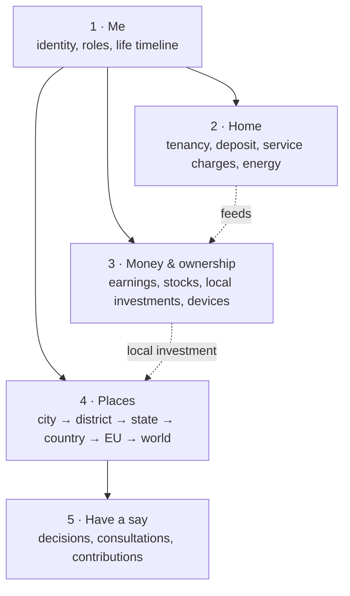

# Ledger of Life: overview of ideas, structure and adapters

Status: 2026-09-26. This is the entry point for the product idea. Precise definitions and rules live in
[`ontology.yaml`](ontology.yaml) and [`ONTOLOGY.md`](ONTOLOGY.md); this page explains how the pieces fit
together for one person, how the app should be organised, and how to decide on adapters.

## 1. The idea in one paragraph

Ledger of Life is one place where a person sees everything that belongs to their life: who they are
(verified, privacy-preserving), where they live and lived, what they own and earn, and what is being
decided around them, from their home to their city, district, state, the EU and the world. Every piece
arrives through an **adapter** (a connection to a wallet, a contract, a device, a public data source).
The rental deposit is the first complete building block. The bigger frame is
[Stadtstack](https://stadtstack.giraeffleaeffle.chatgpt.site): this app is the personal entry point into a
city that perceives, decides, acts and learns.

## 2. One person's overview

Everything a person sees fits into five areas. Each concept has exactly one home.

| Area | Question it answers | Concepts (status) |
|---|---|---|
| **1 · Me** | Who am I here, and what may others learn? | Passkey sign-in and own wallets (built) · EU Digital Identity Wallet check: adult, optional city (built, test environment) · roles per context: tenant, landlord, member, resident (partly built: tenancy roles) · **life timeline**: where I lived, moves, tenancies (new, roadmap) |
| **2 · Home** | Where do I live, and what is locked or owed there? | Listing → application → agreement (built) · deposit escrow that earns, claimable earnings, move-out payouts (built, Solana devnet, simulated yield) · real-time service charges (roadmap) · home solar via Home Assistant (built, read-only) |
| **3 · Money & ownership** | What do I own and earn? | Portfolio total (built) · tokenized stocks on Solana and Robinhood Chain (built, test tokens) · validator stake (built, read-only) · stocks as the deposit (prototype contract) · home tokens towards owning a home (roadmap) · **local investments**: local companies and houses (new, roadmap) · EV and device income (roadmap) |
| **4 · Places** | What is changing where I live, and what can my city afford? | "What is changing in <city>" from the Stadtstack atlas (built, read-only) · public money flow: taxes, redistribution, city budget (roadmap) · measurable city: sensors and open data (roadmap, Stadtstack) · 3D map of projects (exists in the Stadtstack atlas) |
| **5 · Have a say** | Where can I take part, and where am I welcome? | Open consultations with deadlines (built, via atlas) · council decisions (upstream: CCF/OParl) · newcomer welcome: clubs, interests, voucher (roadmap) · offering expertise (roadmap) |

### 2.1 Scales

The app starts with what affects the person directly and widens outward:
person → household → neighbourhood → city → neighbouring cities → Landkreis → state (Land) → country →
EU → world. Every context, figure and decision is tagged with its scale, so the person can zoom out without
losing the thread back to their own life.

### 2.2 Life timeline (new)

A personal, private timeline of where the person lived and what happened there:

- **Entries:** moves (city, from–to), tenancies (created automatically from agreements in the app),
  deposits returned, milestones such as "joined a club" or "bought a first share of a house".
- **Sources:** tenancies from the app itself (reliable); earlier addresses entered by the person
  (self-declared, labeled as such); later, a residence attestation in the EU wallet where authorities issue one.
- **Why:** it explains the person's current state (why a deposit is still open elsewhere, which cities they
  know) and makes moving the moment where the app helps most.
- **Privacy:** the timeline belongs to the person and is never shared by default; each context sees only what
  it needs (a landlord might see "3 completed tenancies, all deposits returned", not the addresses).

### 2.3 Public money flow (roadmap)

Show where a person's taxes go and what comes back to their city, for Germany:

- Income tax is shared; the municipality where the person **lives** receives a share (Gemeindeanteil, currently 15 %).
- Trade tax (Gewerbesteuer) goes to the municipality where the **employer operates**.
- The state redistributes to municipalities through the kommunaler Finanzausgleich (Brandenburg → Strausberg).
- The city budget (Haushalt) and council decisions show what is planned and decided.

Rule: figures come only from published budgets and statistics with source and as-of date. Anything
per person ("your taxes paid for …") is an estimate and must say so.

### 2.4 Local investments (new, roadmap)

Invest directly in companies and houses in one's own city, using the same portfolio as tokenized stocks.

| Form | How it works | What is realistic now |
|---|---|---|
| **Cooperative shares** (Genossenschaft: housing, energy, shop) | Members buy shares, one member one vote; common for community solar and housing | Proven, no tokens needed. Best first step: a directory of local cooperatives from the atlas, with how to join |
| **Local company shares or bonds as electronic securities** | Germany's eWpG allows electronic securities; since 1 January 2024 (Zukunftsfinanzierungsgesetz) also electronic shares, including crypto shares in a crypto securities register run by a BaFin-licensed operator | Possible, but issuance is regulated; the app would only show and hold, issuers do the regulated part |
| **Crowdfunding of local projects** | EU crowdfunding regulation (ECSPR) lets a project owner raise up to €5 million per 12 months through licensed platforms | Link out to licensed platforms; show local projects next to the city's plans |
| **Tokenized real estate** | Tokens cannot carry a German land-register title; they represent shares or bonds of a property company (SPV) or profit participation | Test-network illustration only (fits the existing "home tokens" idea); real offers need a licensed partner |

The link to the city makes this interesting: a person sees a planned project (for example a community solar
park in the atlas), the cooperative or company behind it, and can take part financially and in the
consultation. Rule: no real offers without a licensed partner and legal review; until then everything here
is illustration or test network and labeled as such.

### 2.5 Newcomer welcome (roadmap)

When a person moves (a new entry in the timeline, or a new city from the EU wallet), the app shows the new
city at once: what is being built (3D atlas), what is decided, how to register, and offers that match their
interests (sports clubs, groups), possibly with a welcome voucher from the city. Interests stay with the
person; matching happens on the device or with explicit consent.

## 3. How the app should be organised

### Today (why it feels cobbled together)

- The signed-in home is one long page: role heading "Your home", identity, city, portfolio tiles mixed with
  roadmap tiles, a role intro, tenancy cards, listings, and a separate "Invest" card with its own portfolio.
- The sidebar still belongs to the earlier deposit app: Rental deposit, Claims & settlement, Shared records,
  Activity, and a demo that is not the signed-in journey.
- Built features and roadmap ideas sit side by side with the same visual weight.
- Two portfolio views exist (the Portfolio tiles and the "Invest · stocks on Solana" card).

### Structure (built 2026-09-26)

| Navigation item | Contains | Moves from |
|---|---|---|
| **Overview** | Identity line, portfolio total, the one next step across all areas, what changed since last visit | Page heading, identity strip, portfolio total |
| **Me** | Identity and credentials, roles per context, life timeline, connected adapters and their permissions | Identity strip details, adapter settings |
| **Home** | Current tenancy with its journey, listings (tenant: find a home; landlord: my listings), service charges, home energy | Tenancy cards, Homes card, solar tile |
| **Money** | All holdings in one list (deposit entitlement, stocks per network, validator, later local investments), earnings, invest actions | Portfolio tiles, Invest card, Robinhood tile, validator tile |
| **Places** | My city (atlas projects, consultations, later budget), then wider scales | City card |
| **Ideas** (or "Coming") | Roadmap items, clearly separate and labeled | Dashed roadmap tiles |

Built: the sidebar and the mobile tab bar show these areas; each renders only its own content, and planned
items appear in a dashed "Planned in this area · not built yet" box that links to **Ideas** (one list in
`src/components/ideas.tsx`). Each real tenancy in **Home** has a read-only detail for its agreement terms,
claim/settlement state, shared evidence and test-network operations from that tenancy's authenticated
records. The fictional workflow stays in a separate **Explore demo · made-up people** entry; its internal
views do not appear in the signed-in areas. Test-only shortcuts, including simulated interest and sample
people/listings, sit in one collapsible **Test tools** panel in Home; actions on one's own tenancy remain
in its card.

## 4. Adapters: one contract, then a decision

### 4.1 Common contract

Today each connection is built differently (`adapters.ts`, `eudi.ts`, `city.ts`, `portfolio.ts`,
`robinhood-demo.ts`). They should share one shape so the areas above can render them uniformly:

- **Identity:** id, name, area (Me, Home, Money, Places, Have a say), scale.
- **Reality level** from the ontology (testnet_real, testnet_simulated, read_only_live, prototype,
  illustration, roadmap), shown next to every figure.
- **Provenance:** source, as-of date, review state.
- **Consent:** what the person granted, stored server-side, revocable in **Me**.
- **Direction:** read-only by default; any adapter that moves value needs explicit signing by the person.

### 4.2 Criteria for choosing

1. Does it make the personal overview more complete for the pitch?
2. Is there a standard or an existing source (EUDI/OpenID4VP, OParl/CCF, Stadtstack atlas, Home Assistant, beacon APIs)?
3. Effort to a working test-network or read-only version.
4. Legal and trust risk (money, securities, personal data).
5. Does it reuse what is proven (escrow, portfolio, atlas)?

### 4.3 Proposed decision

| Adapter | Area | Status | Recommendation |
|---|---|---|---|
| EU Digital Identity Wallet | Me | Built, tested with the iOS test wallet | **Keep**, polish |
| Rental deposit escrow (Solana) | Home | Built | **Keep**, core story |
| Stocks: Solana (tSPYx) | Money | Built | **Keep**, merge the two portfolio views |
| Stocks: Robinhood Chain (TSLA) | Money | Built | **Keep** as second network; decide if the pitch needs two chains |
| Stadtstack atlas (city projects) | Places | Built | **Keep**, add budget next |
| Home Assistant solar | Home | Built, read-only | **Keep** |
| Validator (Gnosis/Ethereum/Solana) | Money | Built, read-only | **Keep** |
| Life timeline | Me | New | **Next**: tenancies automatic, earlier moves self-declared |
| City budget and money flow | Places | New | **Next**: data through the Stadtstack atlas, not in this app |
| Real-time service charges | Home | Idea | **Next**: reuses the escrow |
| Local investments | Money / Places | New | **Later**: start with a cooperative directory and a test-network illustration; real offers only with a licensed partner |
| Newcomer welcome, clubs, voucher | Have a say | Idea | **Later**: needs city partners and interest matching |
| CCF council decisions | Have a say | External, running | **Later**, via the atlas or directly from the CCF store |
| Stocks as the deposit | Home | Prototype contract | **Park** until the core flow is polished |
| Home tokens towards owning | Money | Idea | **Park**, becomes part of local investments |
| EV and device tokenization | Money | Idea | **Park** |

### 4.4 Suggested order

1. Reorganise the app into the structure in section 3; no new features. This fixes the cobbled-together feel.
2. Introduce the common adapter contract while moving the existing adapters into their areas.
3. Life timeline (small, personal, shows the "life" in Ledger of Life).
4. City budget via the Stadtstack atlas.
5. Service charges, then local investments.

## 5. Decisions (2026-09-26)

- **Networks:** keep both Solana and Robinhood Chain for now; per feature, use whichever is easier to integrate.
- **Places lives in this app.** Its data comes from open data and the Stadtstack protocol (atlas read model),
  not from anything this app collects itself.
- **Approach:** show the whole organisation, how it would work and what it enables, clearly labeled as
  planned; then build it step by step.

Still to research:

- City budget data: what Strausberg, Brandenburg and other cities publish (Haushalt, Finanzausgleich), in
  which format, and how it enters the Stadtstack protocol.
- Newcomer welcome: which cities or clubs would offer listings or a welcome voucher (idea stage).
- A licensed partner for local investments (cooperatives, eWpG registers, ECSPR platforms).
