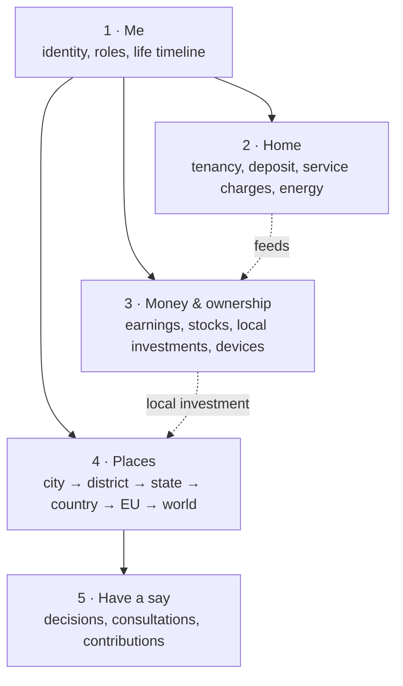

# Ledger of Life: overview of ideas, structure and adapters

Status: 2026-09-26. This is the entry point for the product idea. Precise definitions and rules live in
[`ontology.yaml`](ontology.yaml) and [`ONTOLOGY.md`](ONTOLOGY.md); this page explains how the pieces fit
together for one person, how the app should be organised, and how to decide on adapters.

## 1. The idea in one paragraph

Ledger of Life is one place where a person sees everything that belongs to their life: who they are
(verified, privacy-preserving), where they live and lived, what they own and earn, and what is being
decided around them, from their home to their city, district, state, the EU and the world. Every piece
arrives through an **adapter** (a connection to a wallet, a contract, a device, a public data source).
The rental deposit is the first complete building block. The bigger frame is
[Stadtstack](https://stadtstack.giraeffleaeffle.chatgpt.site): this app is the personal entry point into a
city that perceives, decides, acts and learns.

## 2. One person's overview

Everything a person sees fits into five areas. Each concept has exactly one home.

| Area | Question it answers | Concepts (status) |
|---|---|---|
| **1 · Me** | Who am I here, and what may others learn? | Passkey sign-in and own wallets (built) · EU Digital Identity Wallet check: adult, optional city (built, test environment) · roles derived per context (built for tenancies, owned listings and city; general memberships planned) · **life timeline** (partly built: app tenancies and self-declared earlier places) |
| **2 · Home** | Where do I live, and what is locked or owed there? | Listing → application → agreement (built) · deposit escrow that earns, claimable earnings, move-out payouts (built, Solana devnet, simulated yield) · service-charge account (prototype, example costs and test prepayment, optional live Home Assistant daily consumption) · stocks as the deposit (calculator only; testnet contract prototype) · home solar via Home Assistant (built, read-only) |
| **3 · Money & ownership** | What do I own and earn? | Portfolio total (built) · tokenized stocks on Solana and Robinhood Chain (built, test tokens) · validator stake (built, read-only) · local investment leads for Strausberg (illustration, not verified offers) · home tokens towards owning a home (roadmap) · EV and device income (roadmap) |
| **4 · Places** | What is changing where I live, and what can my city afford? | Personal MapLibre map of published city-wide signals, with private home/work pins and on-device neighbourhood / approximate commute matching (built, read-only; coverage and review vary by city) · Stadtstack atlas projects and consultations (built, read-only) · current DWD weather and nearby uncalibrated citizen PM readings (read-only live) · named OSM clubs/sports facilities (read-only live, not an official directory) · statutory money-flow explainer and Strausberg 2025/26 ordinance headline planned investment outlays (built, not actual spending) · city → Landkreis → Land → Germany → EU links (illustration) · ALLRIS calendar/document links (illustration, no Strausberg OParl feed) |
| **5 · Have a say** | Where can I take part, and where am I welcome? | Open consultations with deadlines (built, via atlas) · Strausberg ALLRIS council calendar/document links (illustration, no imported meetings) · newcomer clubs/sports discovery (read-only live OSM), with interests, registration help and voucher still planned · offering expertise (roadmap) |

### 2.1 Scales

The app starts with what affects the person directly and widens outward:
person → household → neighbourhood → city → neighbouring cities → Landkreis → state (Land) → country →
EU → world. Every context, figure and decision is tagged with its scale, so the person can zoom out without
losing the thread back to their own life.

### 2.2 Life timeline (partly built)

The private timeline currently shows tenancies from this app and earlier places entered by the person,
clearly marked as self-declared. Future entries could include moves with dates, returned deposits and
milestones such as joining a club or buying a first home share. A residence attestation from an EU wallet
could later replace a self-declared address where an authority issues one.

- **Why:** it explains the person's current state (why a deposit is still open elsewhere, which cities they
  know) and makes moving the moment where the app helps most.
- **Privacy:** the timeline belongs to the person and is never shared by default; a future disclosure
  could share a derived predicate (for example "3 completed tenancies, all deposits returned"), not addresses.

### 2.3 Public money flow (explainer built; ordinance headline plan published)

Places links the primary laws for how money reaches municipalities in Germany and cites Strausberg's
published budget ordinance for two headline **planned investment outlay** figures; these are not actual
spending or allocations to any particular project:

- Municipalities receive a **15 % share** of wage and assessed income tax under GemFinRefG § 1, allocated
  by statutory keys linked to residence. This is **not** 15 % of an individual's tax bill paid to their city.
- Trade tax (Gewerbesteuer) belongs to the municipality where business operations take place, and
  Gewerbesteuerumlage reduces gross municipal receipts under GemFinRefG § 6.
- Brandenburg redistributes to municipalities through its BbgFAG fiscal equalisation system.
- The city budget and council records show plans and decisions only if the underlying sources are available.

**Published ordinance versus missing detail:** Strausberg's [2025/26 budget ordinance, § 1,
PDF page 1](https://www.stadt-strausberg.de/wp-content/uploads/2025/04/2024-11-07_Haushaltssatzung_2025_2026.pdf)
states planned investment outlays of **€17,941,270 for 2025** and **€12,609,320 for 2026**.
The complete detailed plan and annexes were not found online and are offered for inspection at the
Kämmerei. BbgKVerf § 69 provides notice and inspection, not a duty to publish the whole plan online.
An electronic copy may be requested under Brandenburg's AIG subject to access rules. No project
breakdown, actual expenditure or open-data licence is inferred. See
[Strausberg budget research](research/CITY_BUDGET_DATA_STRAUSBERG_BRANDENBURG.md#legal-obligations-and-where-the-plan-actually-is)
and [Places source checks](research/ROADMAP_DATA_SOURCES_STRAUSBERG.md).

Rule: figures come only from published budgets and statistics with source and as-of date. Anything
per person ("your taxes paid for …") is an estimate and must say so.

### 2.4 Local investments (illustration; real investment roadmap)

Money currently illustrates four legal forms and links to unverified Strausberg cooperative leads. There
are no offers, available shares, transactions or tokenized home ownership in the app. The future idea is
to invest directly in local companies and property alongside the existing portfolio:

| Form | How it works | What is realistic now |
|---|---|---|
| **Cooperative shares** (Genossenschaft: housing, energy, shop) | Members buy shares, one member one vote; common for community solar and housing | The app shows unverified Strausberg leads, not a directory of joinable cooperatives or open offers |
| **Local company shares or bonds as electronic securities** | Germany's eWpG allows electronic securities; since 1 January 2024 (Zukunftsfinanzierungsgesetz) also electronic shares, including crypto shares in a crypto securities register run by a BaFin-licensed operator | Possible, but issuance is regulated; the app would only show and hold, issuers do the regulated part |
| **Crowdfunding of local projects** | EU crowdfunding regulation (ECSPR) lets a project owner raise up to €5 million per 12 months through licensed platforms | Link out to licensed platforms; show local projects next to the city's plans |
| **Tokenized real estate** | Tokens cannot carry a German land-register title; they represent shares or bonds of a property company (SPV) or profit participation | Test-network illustration only (fits the existing "home tokens" idea); real offers need a licensed partner |

The link to the city makes this interesting: a person sees a planned project (for example a community solar
park in the atlas), the cooperative or company behind it, and can take part financially and in the
consultation. Rule: no real offers without a licensed partner and legal review; until then everything here
is illustration or test network and labeled as such.

### 2.5 Newcomer welcome (clubs partly built; remainder roadmap)

Places shows named OSM clubs and sports facilities for a chosen or EU-wallet city, plus links to
Strausberg's city and district directories. These OSM contributions are not an official directory.
Registration help, interest matching, city-partner offers and a welcome voucher are still planned;
interests would stay with the person and matching would require explicit consent.

### 2.6 Personal city map (built; public signal coverage varies)

The authenticated `GET /api/city-signals?city=<id>` reads the published
`stadtstack-data/out/catalogue.json`, `cities/<id>/signals.geojson` and `changes.json`
(or `STADTSTACK_DATA_DIR`), caching file contents by mtime; it accepts **city ID only**, never home,
work or commute coordinates. City selection comes from the opted-in EU-wallet locality or the
chosen city; uncovered cities offer the catalogue's covered cities for exploration. The hand-written
fictional Strausberg fixture is under `test/fixtures/city-signals/out/` for geometric tests only,
not app data; real published files are the runtime source.

The resident clicks to place home and work pins (or separately requests browser geolocation).
They are stored only in per-city `localStorage` and can be removed. The map does not recenter on
private pins, and no geocoding, routing or private-coordinate request is made. MapLibre uses
OpenFreeMap tiles: **tile requests disclose the viewed map area to the tile provider**, even though
saved pin coordinates are never transmitted; self-hosted tiles could reduce this later.

The browser matches published public geometries to a 1 km straight-line neighbourhood radius and
a 400 m approximate corridor around the straight line from home to work—not a walking or
driving route. Citywide items and a full city list remain available without a pin. Feature cards
show source locators, as-of date, review state (`candidate` means **not yet reviewed**), geometry
precision and an LLM faithfulness score when present. Source status is retained for provenance;
dated consultations whose windows have passed display **closed**, and past roadworks display
**ended (scheduled end; completion not verified)**. Coverage is not a complete inventory.

## 3. How the app should be organised

### Before the reorganisation

- The signed-in home mixed a role heading, identity, city, portfolio and roadmap tiles, tenancy cards,
  listings and a separate Invest card with its own portfolio.
- The sidebar belonged to the earlier deposit app: Rental deposit, Claims & settlement, Shared records,
  Activity and a demo separate from the signed-in journey.
- Built features and roadmap ideas sat side by side with the same visual weight.
- Two portfolio views existed (Portfolio tiles and the Invest card).

### Structure (built 2026-09-26)

| Navigation item | Contains | Moves from |
|---|---|---|
| **Overview** | Identity line, portfolio total, the one next step across all areas, compact \"Near you / in your city\" counts and top sourced signals matched on-device | Page heading, identity strip, portfolio total |
| **Me** | Identity and credentials, roles derived per context (agreement party, owned listing, chosen or wallet city), life timeline with an on-demand earlier-place form, connected adapters and their permissions | Identity strip details, adapter settings |
| **Home** | Active tenancies with a journey that stops at "Living here" until move-out starts, compact past tenancies, on-demand find/rent actions, service charges, home energy | Tenancy cards, Homes card, solar tile |
| **Money** | All holdings in one list (deposit entitlement, stocks per network, validator, later local investments), earnings, invest actions | Portfolio tiles, Invest card, Robinhood tile, validator tile |
| **Places** | Map-first private home/work neighbourhood, straight-line commute and city-wide signals (MapLibre, OpenFreeMap tiles); then existing atlas, weather/air, OSM clubs, money-flow explainer, official directories and wider-scale links | City card |
| **Ideas** (or "Coming") | Roadmap items, clearly separate and labeled | Dashed roadmap tiles |

Built: the sidebar and the mobile tab bar show these areas; each renders only its own content. Remaining
roadmap work appears in a dashed "More to build in this area" box that links to **Ideas** (one list in
`src/components/ideas.tsx`); illustrations are labeled separately. Each real tenancy in **Home** has a
read-only detail for its agreement terms,
claim/settlement state, shared evidence and test-network operations from that tenancy's authenticated
records. The fictional workflow stays in a separate **Explore demo · made-up people** entry; its internal
views do not appear in the signed-in areas. Test-only shortcuts, including simulated interest and sample
people/listings, sit in one collapsible **Test tools** panel in Home; actions on one's own tenancy remain
in its card.

Account setup is role-free. The person sees their agreement roles and owned listings, not a saved display
preference; browsing homes and posting a listing open only on request. While a tenancy is active its move-out
details stay behind a quiet "Moving out?" action, and finished tenancies move to **Past tenancies**.

The Home service-charge account is a collapsed prototype per active tenancy: the landlord sets only an
example prepayment; example annual allocations and daily consumption estimates drive a running balance.
An available Home Assistant daily consumption sensor is identified as live, not as a bill; solar production
is never called consumption. Nothing moves on-chain. A separate stock-collateral calculator sits only in
home discovery or the deposit step. Money's collapsed local-investment card names four legal forms and
unverified Strausberg cooperative leads; it cannot accept investments.

Money's Solana and Robinhood test stocks use read-only Jupiter reference prices. Server reads share one
in-flight request per mint and cache quotes for 60 seconds; an upstream throttle retains the last good
price with its original observation time and waits another minute before trying again. Without a prior
quote, the affected holding shows a temporary-unavailability state and retries rather than displaying a
partial portfolio total or a raw JSON error. Stale prices are labeled and disable test buy controls;
Solana buy preparation also requires a current quote. Solana portfolio chain reads coalesce per wallet
for four seconds, and Home's solar-only tile skips stock reads.

## 4. Adapters: one contract, then a decision

### 4.1 Common contract

Today each connection is built differently (`adapters.ts`, `eudi.ts`, `city.ts`, `portfolio.ts`,
`robinhood-demo.ts`). They should share one shape so the areas above can render them uniformly:

- **Identity:** id, name, area (Me, Home, Money, Places, Have a say), scale.
- **Reality level** from the ontology (testnet_real, testnet_simulated, read_only_live, prototype,
  illustration, roadmap), shown next to every figure.
- **Provenance:** source, as-of date, review state.
- **Consent:** what the person granted, stored server-side, revocable in **Me**.
- **Direction:** read-only by default; any adapter that moves value needs explicit signing by the person.

### 4.2 Criteria for choosing

1. Does it make the personal overview more complete for the pitch?
2. Is there a standard or an existing source (EUDI/OpenID4VP, OParl/CCF, Stadtstack atlas, Home Assistant, beacon APIs)?
3. Effort to a working test-network or read-only version.
4. Legal and trust risk (money, securities, personal data).
5. Does it reuse what is proven (escrow, portfolio, atlas)?

### 4.3 Proposed decision

| Adapter | Area | Status | Recommendation |
|---|---|---|---|
| EU Digital Identity Wallet | Me | Built, tested with the iOS test wallet | **Keep**, polish |
| Rental deposit escrow (Solana) | Home | Built | **Keep**, core story |
| Stocks: Solana (tSPYx) | Money | Built | **Keep**, merge the two portfolio views |
| Stocks: Robinhood Chain (TSLA) | Money | Built | **Keep** as second network; decide if the pitch needs two chains |
| Stadtstack atlas (city projects) | Places | Built, read-only live | **Keep** atlas provenance and review state |
| DWD via Bright Sky and sensor.community | Places | Read-only live weather and nearby uncalibrated citizen PM sensors | **Keep** times, distances, licences and stale labels; no city-wide air-quality claim |
| OSM clubs and sports via Overpass | Places | Read-only live named objects, not an official directory | **Keep** ODbL attribution and official Strausberg directory links; no partner offer implied |
| Public money flow and Strausberg budget access | Places | Sourced statutory explainer and ordinance headline **planned** investment outlays (2025 €17,941,270; 2026 €12,609,320), no actual spending or detailed project allocations | Obtain complete plan and reuse terms before a spending breakdown |
| From your street to the world | Places | Personal map's home-neighbourhood, city and approximate straight-line commute matching built; district/state/country/EU links remain illustration | Expand reviewed city coverage, then wider-scale feeds |
| Council decisions | Places | Strausberg ALLRIS links only; where the public signals feed covers other cities, distinguish sourced papers/meetings from adopted decisions | Reviewed/rights-cleared council data and explicit decisions |
| Home Assistant solar | Home | Built, read-only | **Keep** |
| Validator (Gnosis/Ethereum/Solana) | Money | Built, read-only | **Keep** |
| Life timeline | Me | Partly built: app tenancies and labeled self-declared earlier places | **Next**: residence attestations where issued, private milestones |
| Real-time service charges | Home | Prototype example statement with landlord-set test prepayment, optional live daily Home Assistant consumption; no escrow funding or payouts | **Next**: authorized meters, invoices and escrow settlement |
| Local investments | Money | Illustration: four legal forms and unverified Strausberg cooperative leads; no offers or investment | **Later**: verify providers and find a licensed partner |
| Newcomer welcome | Places | Partly built: live OSM clubs and official directories; no matching, registration or voucher | **Later**: city partners and consent-based matching |
| Stocks as the deposit | Home | Prototype: 150 % collateral calculator and Robinhood Chain testnet contract; no pledge flow | **Park** real integration pending legal and security review |
| Home tokens towards owning | Money | Planned; part of local investments | **Park** until legal wrapper and partner exist |
| EV and device tokenization | Money | Planned | **Park** |

### 4.4 Suggested order

1. **Done:** reorganise the signed-in overview, build a partial life timeline, service-charge
   prototype, local-investment illustrations, read-only Places feeds and the on-device personal map.
   Strausberg's ordinance headline *planned* investment outlays are shown with source; no actual
   spending or detailed allocations are claimed.
2. **Next:** obtain Strausberg's full 2025/26 detailed plan and reuse terms through inspection or
   an AIG request before showing a project-level breakdown.
3. Introduce the common adapter provenance/permission contract while preserving each feed's reality
   level, observation time, licence and stale state.
4. Pursue authorized meter/invoice inputs before any service-charge settlement, and confirm a permitted
   council feed before presenting meeting records.
5. Verify local providers and secure a licensed partner before offering investments or vouchers.

## 5. Decisions (2026-09-26)

- **Networks:** keep both Solana and Robinhood Chain for now; per feature, use whichever is easier to integrate.
- **Places lives in this app.** Its data comes from open data and the Stadtstack protocol (atlas read model),
  not from anything this app collects itself.
- **Approach:** show the whole organisation, how it would work and what it enables, clearly labeled as
  planned; then build it step by step.

Still to research:

- Strausberg's complete 2025/26 budget plan, reuse terms and verified line items (current ordinance links
  to inspection, not a complete online dataset); comparable cities publish plans online.
- Newcomer welcome: which cities or clubs would offer listings or a welcome voucher (idea stage).
- A licensed partner for local investments (cooperatives, eWpG registers, ECSPR platforms).
