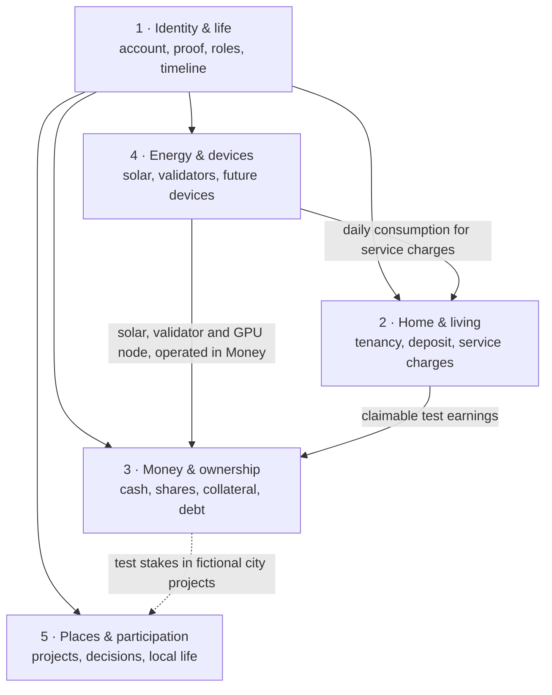

# Ledger of Life: overview of ideas, structure and adapters

Status: 2026-09-28. This is the entry point for the product idea. Precise definitions and rules live in
[`ontology.yaml`](ontology.yaml) and [`ONTOLOGY.md`](ONTOLOGY.md); this page explains how the pieces fit
together for one person, how the app should be organised, and how to decide on adapters.

## 1. The idea in one paragraph

Ledger of Life is one place where a person sees everything that belongs to their life: who they are
(verified, privacy-preserving), where they live and lived, what they own and earn, and what is being
decided around them, from their home to their city, district, state, the EU and the world. Every piece
arrives through an **adapter** (a connection to a wallet, a contract, a device, a public data source).
The rental deposit is the first complete building block. The bigger frame is
[Stadtstack](https://stadtstack.giraeffleaeffle.chatgpt.site): this app is the personal entry point into a
city that perceives, decides, acts and learns.

## 2. One person's life

Five domains organise the person's ledger, and one thread runs through them: find a home, secure the deposit, keep your assets, help build your city ([INFORMATION_ARCHITECTURE.md](INFORMATION_ARCHITECTURE.md#the-thread-and-the-next-step)). **Home** is the daily entry point for tenancy status and the action needed now; **Money** owns holdings and financial workflows; **Places** owns neighbourhood and public life; **Me** owns sign-in, wallets, private history and grouped connections; the **Roadmap** (area id `ideas`) is a secondary sidebar link separating planned from working features. Public life is one domain, not the whole product. Each feature has one home, and every other area shows only a reference that links there.

| Domain / detail area | Question it answers | Concepts (status) |
|---|---|---|
| **1 · Identity & life / Me** | Who am I here, and what may others learn? | Passkey sign-in and own wallets (built) · optional adult/city proof (EU test wallet) · tenancy/listing/city contexts (built; general memberships planned) · private timeline (partly built: app tenancies and self-declared earlier places) |
| **2 · Home & living / Home** | Where do I live, and what is locked or owed there? | Listing → application → agreement, cash escrow and move-out payouts (built, Solana devnet with simulated test credit) · share-backed deposit on Robinhood Chain testnet (built; proven on this site on 1 October 2026 with three fresh accounts) · service-charge example/test prepayment (prototype, not a bill) · home ownership (roadmap) |
| **3 · Money & ownership / Money** | What do I own, owe and earn? | Priced-test-assets subtotal · Solana tSPYx and official faucet Robinhood test TSLA · shared-pool collateral, loans and lending when deployed · fictional housing/workshop units (`tHOME`/`tWORK`) and checked purchase receipts · real bank accounts and housing rights (roadmap) |
| **4 · Energy & devices / Money** | What can I observe from things I run? | Home Assistant energy/solar, public Gnosis/Ethereum/Solana validator readings and the local AI node are operated in Money → Devices & income. Other people's GPUs, solar and validator ids join through the Home Node (a local program with an MCP setup option) that pushes signed readings, so the hosted site shows solar without ever reading a home network; solar income to the building is simulated and not yet funded or proven live. Me owns local-mode configuration; Home's service charges read the same Home Assistant consumption. A validator identifier does not prove ownership of its stake. EV feeds and income tokenization remain planned. |
| **5 · Places & participation / Places** | What is changing around me, and where can I participate? | Published city map/signals, projects, source-linked outcomes, device-local following, news/events, regional topics, consultations, council papers where covered, DWD/citizen readings and OSM discovery. Strausberg ALLRIS remains outbound links; budget figures are headline plans, not actual spending. Wider-scale feeds, verified memberships, vouchers and offering expertise remain planned. |

### 2.1 Scales

The app starts with what affects the person directly and widens outward:
person → household → neighbourhood → city → neighbouring cities → Landkreis → state (Land) → country →
EU → world. Every context, figure and decision is tagged with its scale, so the person can zoom out without
losing the thread back to their own life.

### 2.2 Life timeline (partly built)

The private timeline currently shows tenancies from this app and earlier places entered by the person,
clearly marked as self-declared. Future entries could include moves with dates, returned deposits and
milestones such as joining a club or buying a first home share. A residence attestation from an EU wallet
could later replace a self-declared address where an authority issues one.

- **Why:** it explains the person's current state (why a deposit is still open elsewhere, which cities they
  know) and makes moving the moment where the app helps most.
- **Privacy:** the timeline belongs to the person and is never shared by default; a future disclosure
  could share a derived predicate (for example "3 completed tenancies, all deposits returned"), not addresses.

### 2.3 Public money flow (explainer built; ordinance headline plan published)

Places links the primary laws for how money reaches municipalities in Germany and cites Strausberg's
published budget ordinance for two headline **planned investment outlay** figures; these are not actual
spending or allocations to any particular project:

- Municipalities receive a **15 % share** of wage and assessed income tax under GemFinRefG § 1, allocated
  by statutory keys linked to residence. This is **not** 15 % of an individual's tax bill paid to their city.
- Trade tax (Gewerbesteuer) belongs to the municipality where business operations take place, and
  Gewerbesteuerumlage reduces gross municipal receipts under GemFinRefG § 6.
- Brandenburg redistributes to municipalities through its BbgFAG fiscal equalisation system.
- The city budget and council records show plans and decisions only if the underlying sources are available.

**Published ordinance versus missing detail:** Strausberg's [2025/26 budget ordinance, § 1,
PDF page 1](https://www.stadt-strausberg.de/wp-content/uploads/2025/04/2024-11-07_Haushaltssatzung_2025_2026.pdf)
states planned investment outlays of **€17,941,270 for 2025** and **€12,609,320 for 2026**.
The complete detailed plan and annexes were not found online and are offered for inspection at the
Kämmerei. BbgKVerf § 69 provides notice and inspection, not a duty to publish the whole plan online.
An electronic copy may be requested under Brandenburg's AIG subject to access rules. No project
breakdown, actual expenditure or open-data licence is inferred. See
[Strausberg budget research](research/CITY_BUDGET_DATA_STRAUSBERG_BRANDENBURG.md#legal-obligations-and-where-the-plan-actually-is)
and [Places source checks](research/ROADMAP_DATA_SOURCES_STRAUSBERG.md).

Rule: figures come only from published budgets and statistics with source and as-of date. Anything
per person ("your taxes paid for …") is an estimate and must say so.

### 2.4 Local investments (native test units; real issuer rights remain roadmap)

Money → Local stakes offers two distinctly fictional Robinhood testnet issuers:
Neighbourhood Homes (`tHOME`) and Neighbourhood Works (`tWORK`). Each has a separate fixed
10,000-unit supply, 18 decimals and a pinned test market using the existing 6-decimal test USD.
A person reviews an amount, signs an exact approval if necessary, then signs the purchase.
Canonical receipts and matching cash/unit effects establish completion; approval alone does not.

The shared test USD can already be held in the wallet or come from the separate share-backed
test loan. Borrowing and buying are distinct approvals; buying units does not repay debt.
The original faucet-funded purchase proof remains separate. The historical Privy route
completed two-share collateral → 12 tUSDG borrowing → 5 tHOME and 5 tWORK →
0.01 tUSDG local inference payment under the former flat-price scheme. Its [connected evidence](evidence/BORROW_TO_LOCAL_AI_ROBINHOOD_TESTNET.json)
used **per-wallet fake stock and an operator-set price**, not the new official-stock shared pool.
It proves those historical transfers, not mirror pricing, borrower-funded earnings or per-token `upto` settlement.
See also [the earlier purchase proof](evidence/LOCAL_CITY_INVESTMENTS_ROBINHOOD_TESTNET.json).

The building, workshop supply relationship, solar/heat-pump choices and city flywheel remain
project ideas, shown as a labelled sketch inside Money → Local stakes (the housing example also shows a
pitched 3D OpenStreetMap view of the fictional house at an illustrative spot; the Röbel/Müritz Agri-PV
proposal appears only in a separate illustrative calculator, not as a project to buy). Each GPU device shows
whether its income goes to the building or the owner's wallet. Local Qwen GPU inference is a
working service operated in Money → Devices & income; Me's adapter, the sketch's GPU option, the
ownership path and the library profile link there. Official x402 v2 `upto`/Permit2 authorizes
at most `maxOutputTokens × 100` atomic tUSDG and settles 100 atomic tUSDG (0.0001 tUSDG)
per reported output token only after a complete answer with `done: true` and `done_reason: "stop"`
is saved. Token-limit, incomplete, interrupted or failed inference costs nothing. The existing
finite 0.10-tUSDG approval and dedicated facilitator key are unchanged; the signed `to`,
`facilitator` and `validAfter` witness restricts settlement through the `upto` proxy
`0x4020A4f3b7b90ccA423B9fabCc0CE57C6C240002` to the named payee and facilitator within the
maximum and validity window, not general wallet authority. Public city AI is available to
anyone; residence is not checked. With
`LOCAL_AI_LIBRARY_ENABLED=1`, `/library` enables connector and direct free mode using a revocable
visitor session: 30 shared attempts per UTC day and three per visitor. Connector free answers
require explicit public-question consent and an owner-opted-in host (`freePublicAnswers`,
default `false`); they create no payment or payout. Paid third-party answers use the same
bounded per-output-token price. This describes the intended configuration, not a new public release.
Observed usage and confirmed receipts remain separate from editable euro host-cost scenarios.

The test units establish neither company equity, cooperative membership nor property title.
Real organization profiles expose sourced services and published participation channels,
not affiliation with the sample issuers. One compact Demo mode control supplies general
workspace context; transaction reviews and source details retain the consequential distinctions.

| Form | How it works | What is realistic now |
|---|---|---|
| **Cooperative shares** (Genossenschaft: housing, energy, shop) | Members buy shares, one member one vote; common for community solar and housing | The app shows unverified Strausberg leads, not a directory of joinable cooperatives or open offers |
| **Local company shares or bonds as electronic securities** | Germany's eWpG allows electronic securities; since 1 January 2024 (Zukunftsfinanzierungsgesetz) also electronic shares, including crypto shares in a crypto securities register run by a BaFin-licensed operator | Possible, but issuance is regulated; the app would only show and hold, issuers do the regulated part |
| **Crowdfunding of local projects** | EU crowdfunding regulation (ECSPR) lets a project owner raise up to €5 million per 12 months through licensed platforms | Link out to licensed platforms; show local projects next to the city's plans |
| **Tokenized real estate** | Tokens cannot carry a German land-register title; they represent shares or bonds of a property company (SPV) or profit participation | Test-network illustration only (fits the existing "home tokens" idea); real offers need a licensed partner |

The scenario connects citizen capital → enterprise → wages/suppliers → households/housing →
builders → public budget/services → quality of life, with dashed assumptions and visible leakage.
Source-backed project progress, city geometry and evidence never turn this loop into a forecast;
actual local investment, population, tax and wellbeing effects remain unverified.

### 2.5 Newcomer welcome (guide built for Strausberg; vouchers and partners roadmap)

`/welcome/<city>` is a public guide for the first months in a city, with no account, meant to be
handed over at registration as a link or QR code. Strausberg has one: a sourced plan by phase
(registration and services first, then the social steps), what is on soon from the published
feed, the clubs, facilities and groups a newcomer can try, and the organisations to ask. Every
item cites a page read on a stated date. It is a community guide, not an official city service,
and it loads nothing from a third party. The reader's situation and interests stay on the device
(the interests are the same store Places uses) and order or highlight items but never hide one.
Places also shows named OSM clubs and sport places in the published city map, plus a separate live
Overpass list only for leisure facilities without those tags; OSM contributions are not an
official directory. City-partner offers and a welcome voucher are still planned.

### 2.6 Personal city map (built; public signal coverage varies)

The authenticated `GET /api/city-signals?city=<id>` reads the published
`stadtstack-data/out/catalogue.json`, compact `cities/<id>/signals.min.geojson`
when the catalogue advertises `minUrl` (otherwise `signals.geojson`), and `changes.json`
(or `STADTSTACK_DATA_DIR`), caching file contents by mtime. The compact file drives map
and lists; selecting an item fetches its full record and source locators through
`GET /api/city-signals?city=<id>&id=<publicSignalId>`. These endpoints accept **only city
and optional public signal ID**, never home, work, interests, categories or commute
coordinates. City selection comes from the opted-in EU-wallet locality or chosen city,
but the resident can explore **any** covered city in the catalogue without changing it.
The hand-written fictional Strausberg fixture is under `test/fixtures/city-signals/out/`
for geometric tests only, not app data; real published files are the runtime source.

The resident clicks to place home and work pins (or separately requests browser geolocation).
They are stored only in per-city `localStorage` and can be removed. The map does not recenter on
private pins, and no geocoding, routing or private-coordinate request is made. MapLibre 6.11.2
uses OpenFreeMap assets through the same-origin `/api/map/` proxy. The provider sees the
server's IP and requested map area, not the visitor's IP, cookies or saved pin coordinates.
The proxy allows only the Liberty style, its tile manifest, vector/raster tiles, glyphs and
sprites, rejects redirects and query parameters, limits responses to 8 MiB and 10 seconds,
and keeps at most 128 entries / 24 MiB in memory for one hour. Attribution is preserved.
MapLibre 6 requires WebGL2 and ESM namespace imports; `predev` and `prebuild` copy its
matching worker and shared module into `public/maplibre/` for Next's asset pipeline.

The browser matches published public geometries to a 1 km straight-line neighbourhood
radius and a 400 m approximate corridor around the straight line from home to work—not
a walking or driving route. Pins are scoped by city; exploring a different city never
matches the first city's pins. Each ring initially shows its ten most relevant items
with a "Show more" control. The city list shows citywide council matters, budgets and
city-scale projects, not thousands of local places; a place appears there only when
its category is switched on. Optional sport/kids/shops/health/culture interests, stored
**on this device only**, rank matching places and council items by title/category.
MapLibre clusters points by kind and loads polygons only at street-level zoom. Feature
cards fetch the full record and show source locators, as-of date, review state
(`candidate` means **Not yet checked**), geometry precision and the publisher's extraction
metadata when present. Official sensors and city news are automatically attributed; only
our own interpretations require human review. Source status is retained for provenance;
expired consultations are **closed**, and past roadworks are **ended (scheduled end;
completion not verified)**. Coverage is not a complete inventory.

### 2.7 One project, several visual lenses (built 2026-09-27)

Places shares a selected city/project/topic across **Map → Outcomes → Connections**. MapLibre
reuses published signal IDs, source geometry, review and precision; choosing a map item preserves
that identity in the outcome drawer, and the project selector can return to its actual map location.
Unlocated heat-plan, citywide budget and Münster trial cases have no map pin. Switching from
a mapped item to an unlocated project clears its old source panel and restores the published
city-centre map context; switching between mapped projects likewise drops the previous detail.
Münster's report names a bus corridor and contains maps, but no matching published CitySignal
geometry was verified. The city map is context, not an invented trial route. Plan boundaries are
proposal context, never future buildings, built footprint or an affected-area prediction.

Outcomes separates lifecycle progress from observed indicators and causal benefits. Planned and
reported-output metrics retain their units; five cases visibly name their missing baseline,
follow-up or actual-use evidence. Solarpark's 48 MWp / ~41.5 ha are planned; Kulturpark
phase 1 is reported present (volleyball court, playground, barrier-free paths), while its
phase-2 opening and two tables remain scheduled. The 2025/26 budget values are planned yearly outlays.
Each source-backed output has its own basis, URL, locator and date (unknown if not supplied);
the meaningful missing-benefit indicator lives on the same evidence record, not in a UI topic lookup.
Rüdersdorf heat-plan adoption and two suitability areas are reported governance outputs, not
delivered heat networks or saved emissions; Strausberg's inspected heat page does not confirm
the scheduled adoption happened. The historical Münster 2021 bus-priority trial is the first
case with a reported before/during measurement: buses traversing the complete Ludgeriplatz →
Hauptbahnhof → Eisenbahnstraße route averaged **251 s (17–30 June 2019) versus 235 s
(23 August–5 September 2021)**, a 16 s (~6.4%) lower observed mean. Each window covered 12
Monday–Saturday days outside summer holidays; the count of bus trips is not reported. The
same official [evaluation report](https://www.stadt-muenster.de/fileadmin/user_upload/stadt-muenster/61_verkehrsplanung/pdf/verkehrsversuche2021_endbericht.pdf)
(PDF pp. 12, 125–141) reports 500 m added bus lane, €60,000 forecast expenditure and
~€42,000 recorded by end-2021 while the trial continued; its funding source, final cost and
current status are unknown. Source-backed actor→role→activity links separate municipal steering,
traffic coordination, Stadtwerke GPS data and LK Argus evaluation. This is **not** an isolated lane
effect, door-to-door passenger result or causal/net benefit: different years/pandemic conditions,
other trials and roadworks, reported car queues and no control route limit attribution. The other
five cases still lack a measured benefit indicator. The source drawer retains URLs, page locators,
check date, review state and geometry precision. Nearby weather/PM is independent context.

Connections starts in observed mode without inventing causal links. An explicit scenario toggle
shows the fictional conserved-capital local-economy graph, editable allocation and independent
public-finance assumptions; dashed edges and shapes remain distinct from source-backed facts.
Selecting a node highlights connected relations but does not create geographic claims or add
anything to portfolio/net worth. Ideas groups all 16 original capability IDs in a compact
person → home → enterprise → city → measure journey; selecting one opens one concise detail
and a working destination where present. Places owns project outcomes and connections in a
disclosure, including the clearly dated historical Münster example. It opens the exact project
and its evidence without changing the person's chosen city or map pins.

### 2.8 Follow public projects (built 2026-09-28)

Places lets a signed-in person follow the selected public signal or one of the six sourced
project cases, including unlocated Münster and municipal heat plans. Linked map signals share
their canonical case follow, so the same budget or park project is not followed twice. This is
not membership, an investment, a role or a notification subscription. The list and comparison
snapshots are stored only in this browser under the authenticated account and city/target;
private pins, interests and follow lists are never uploaded. Refresh requests use only the
public city and exact signal ID. Other cities can be explored without changing the chosen city.

First follow re-reads every linked **current full public record** before saving a successful
baseline, not the older compact city-list snapshot; partial/failed reads cannot follow.
Old imported evidence or a change already visible when following is not announced as a
new decision. Later successful reads compare published status, dates and evidence-review
state, meaningful changes to the published next-step *note*, figures in budget descriptions,
and structured curated outputs, amounts and observed samples. A review-state change is
**not** project approval; a generic end date is **not** necessarily a consultation deadline.
Next-step notes are not verified invitations to act: changed action category or date can be
reviewed at the original public source, while cosmetic rewording stays quiet. Text-only
headline/statement edits, source hashes, retrieval time, model scores and publisher snapshot
order do not generate follow updates. Published budget records have no typed amount/basis
field. Grouping/order changes to numeric figures stay quiet; changed numeric figures or
explicit planned/recorded/provisional *wording* are shown as **description corrections
with original source wording**, not actual spend. Unlocated cases compare the app's researched
evidence record; this does not monitor the external PDF for new publications. Linked cases require
every mapped public record to load.

Unseen changes survive reload and other successful refreshes until individually marked read,
including older changes outside the compact followed-development preview in Places. Acknowledging any displayed event
does not consume other unseen events or a later arrival. A disappearing individual evidence
fact is marked **no longer stated**, not zero or cancellation. Missing public records and
failed sources retain pending changes and show an unavailable state, never an inferred
completion. Unfollow deletes only that target's saved state; old in-flight refreshes and
stale read callbacks cannot affect a newly refollowed instance. A pending first follow
is also abandoned after *any* intervening selection/review, even if a person navigates
A→B→A before the old source response arrives. Corrupt browser storage is reported
and never overwritten as an empty list. Places shows no follow panel when none exist;
updates open the exact case and changed linked signal (or generic signal) in Places. Each
review re-fetches its full public record: current status/evidence replaces the compact
headline, and a failed detail refresh reports unavailability rather than presenting old
status as fresh. Curated case outputs retain their source-era dates/basis separately.
No push/email service or invented action deadline.

## 3. How the app should be organised

### Before the reorganisation

- The signed-in home mixed a role heading, identity, city, portfolio and roadmap tiles, tenancy cards,
  listings and a separate Invest card with its own portfolio.
- The sidebar belonged to the earlier deposit app: Rental deposit, Claims & settlement, Shared records,
  Activity and a demo separate from the signed-in journey.
- Built features and roadmap ideas sat side by side with the same visual weight.
- Two portfolio views existed (Portfolio tiles and the Invest card).

### Structure (updated 2026-10-03)

| Navigation item | Contains | Moves from |
|---|---|---|
| **Home** | Default entry point: one tenancy Hero with a fictional-house 3D map or flat map, role subtitle and status; role-specific figures and one ActionBox only when the person must act. About this tenancy is a full-width row list directly below the Hero for rent/receipts, handover, service charges, moving out and agreement/activity; an idle arbitrator sees only Agreement & activity. Setup and move-out have a compact checked phase line; living has no step counter. With no current home, Find a home opens listings. Final rows open other homes, renting out, past homes and local-only rehearsal tools | Reuses listing/agreement/tenancy handlers; neighbourhood belongs to Places |
| **Money** | **Holdings** (total test value and free/locked/lent/owed bar when available; otherwise one status sentence replaces figure, bar and legend; holding rows, four plain test-money needs with one action each, Valuation details), **Borrow & lend** (loan/lending cards; task panel only after picking an action), **Local stakes** (House / Workshop / Agri-PV picker, Hero and detail rows), **Devices & income** (device rows, compact city AI and hardware economics); collateral/debt/cash counted once | Deployment-dependent wallet-signed actions, honest provenance and liquidity limits |
| **Places** | Header with city, Get settled, weather reading and Change city; one visit-change line (“Nothing new since your last visit.” when unchanged), one layer-chip row and map with its 3D/2D switch; one row list for Map settings, Project outcomes & connections, Weather & air; Have your say (Open consultations, Followed projects, Browse projects), Events & news, Who does what, Nearby towns and Council tabs; one public-source note | One owner for neighbourhood, public projects and following |
| **Me** | Compact Sign-in & wallets (Deposit wallet on Solana, Shares wallet on Robinhood Chain), private Life timeline with earlier places on demand and a plain-caption note; individual connection rows only for EU identity wallet, Home solar (Home Assistant) and Validator activity; Built into your account (13) groups automatic sources with “Included with your account” or “N need you”, Planned connections (3) groups future sources. View reading appears only for configured connections | One configuration owner |
| **Roadmap** (id `ideas`) | Every capability from `src/data/ledger-catalogue.ts`, grouped by availability (available on this site, needs a local setup, planned), one selected detail, exact working destinations (`Idea.destination`) and links back to the related adapters | One capability definition in `src/data/ledger-catalogue.ts` |

The sidebar and mobile tab bar show Home, Money, Places and Me. Roadmap is the fifth area,
reached as a secondary sidebar link and from the "Test networks" explainer. `/` opens Home.
Page headings are an h1 only, without stage eyebrows or subtitles; there is no breadcrumb
or signed-in path strip. Account management lives in Me. Places owns the map and public-life
detail; Roadmap owns the capability list. A feature has one home and references elsewhere.

Home answers “Is my home OK?” with status, figures and the action needed now, not a living
step counter. Outside Home, the next-step card appears only for urgent steps.
Money → Holdings alone publishes the complete-snapshot priced subtotal.
Places owns official city press, followed developments and the chosen-city visit comparison.
Living landlords have two figures: Deposit held and Rent this month received, whose note
includes the house's 20 % share and next payment date. Money amounts use a "$" prefix and
two decimals app-wide (for example, "$1,300.00"); token amounts retain their symbol.
The generic city visit comparison eagerly advances successful city snapshots and is not the
followed unread queue. The latter starts from first follow, retains individual pending events
until read and reports source outages rather than inferring project closure. Details expand
on request without hiding publisher, date, review state or stale/test labels. Home owns deposit
and earnings actions without linking to a Money deposit holding. Money's deposit and operation
trail links back to the actual tenancy. One tSPYx holding owns its purchase control; the
official Robinhood test TSLA uses one mirror valuation in wallet and collateral; Solana tSPYx remains separate.
Share rental deposits are operated in Home; loans and lending are operated in Money → Borrow & lend.
The focused Borrow & lend task panel opens only after the person picks an action; the existing
wallet-signing and readiness gates are unchanged.
Shared-market positions distinguish wallet shares, loan collateral, debt and lender value.
Old fake-stock contracts and store records are unused without migration, not current holdings.
Deployment addresses are setup evidence, not user transactions. The deposit activity trail reads authenticated
agreement operations and labels the stored creation time as such, not as settlement time.

Regional comparison previews put a chosen town's own source item and another named
municipality's source item side by side with each separate stage and known source date.
The published evidence expands in Places; the public map locates only records with real
geometry. A matching topic does not imply cooperation, outcomes or that one town is
better than another. Candidate interpretations remain **Not yet checked**.

The shared civic dataset should grow into a useful **versioned, source-attributed knowledge
base** consumed by Ledger, the Stadtstack atlas and read-only MCP. Demonstrating useful
cross-town comparisons can encourage municipalities to publish interoperable open data;
neither a record count nor an outbound link proves municipal endorsement, completeness,
reuse rights or a successful policy outcome. Keep source URL/locator, municipality, date
when known, per-source stage, review state and location precision through publication and
display. This is a product goal using the existing publication, not a new database or
ingestion programme.

Each real tenancy in **Home** has a
read-only detail for its agreement terms,
claim/settlement state, shared evidence and test-network operations from that tenancy's authenticated
records. The signed-in workspace has one real-account journey; it does not offer a fictional-person
demo or actor switch. Test-network balances and workflows are gated by their actual account and
connection requirements, and remain distinct from live-money claims.

Account setup is role-free. The person sees their agreement roles and owned listings, not a saved display
preference; browsing homes and posting a listing open only on request. While a tenancy is active its move-out
details stay behind a quiet "Moving out?" action, and finished tenancies move to **Past tenancies**.

The Home service-charge account is a collapsed prototype per active tenancy: the landlord sets only an
example prepayment; example annual allocations and daily consumption estimates drive a running balance.
An available Home Assistant daily consumption sensor is identified as live, not as a bill; solar production
is never called consumption. Nothing moves on-chain in service charges. Home now offers the share-backed
deposit itself: official test TSLA at 150 % cover, settlement in TSLA, no forced sale; proven on this site on 1 October
2026 with three fresh passkey accounts. Money's local investment surface executes fictional test-unit purchases; real cooperative leads still are not offers.

Solana tSPYx retains read-only Jupiter reference pricing. Official Robinhood test TSLA
uses the same mainnet Chainlink RHTSLA/USD mirror as shared-pool collateral; Jupiter
TSLAx is a cross-check only, never a fallback quote. The mirror is not a Chainlink contract.
Show source round/time, copied time, age and stale/closed-market status. Missing deployment
is undeployed, with no invented price or pool. Failed reads never become zero balances.
Freshness is 26 hours normally, 74 hours Saturday 00:00 UTC–Monday 12:00 UTC.
Closed markets retain dated last prices; stale pricing freezes price-sensitive actions.

Money → Holdings publishes a **priced-test-assets subtotal** only after Solana, official TSLA
and shared loan/lender reads settle successfully together. A nonzero official TSLA holding
with stale pricing or an undeployed mirror blocks the numeric subtotal. The prior snapshot
is retained internally; only its dated last-complete timestamp is shown, not its prior numeric value. Wallet TSLA is counted
once at the mainnet token price converted to the test token's multiplier, plus collateral
and lender claims, minus debt. Project issue prices are not market/resale quotes.
Independent share-earnings read failure leaves healthy wallet, pledge and loan balances available, but
pauses earnings-dependent actions rather than offering a new demo faucet. Requests belong
to one signed-in account and wallet; older responses cannot replace another account's
data or a newer balance check. Confirmed test actions invalidate balance displays even
when a subsequent refresh fails, without inviting another signature.

That subtotal captures the Home tenancy entitlement used in its valuation.
A newly checked deposit can update its own tile while the older complete subtotal remains dated;
the entitlement change starts a coordinated recheck instead of mixing new deposit money
with older wallet holdings. Validator and Home solar cards report their own adapter status,
not an unrelated share-position or quote error.

Holdings separates **free to use** (wallet cash/shares), **locked in the rental deposit**
(escrow entitlement), **pledged as collateral** (loan shares), **lent** (lender share value),
and **owed** (debt subtracted once). Borrowed wallet cash is already free to use; supplied
cash is not counted again outside its lender claim. Official wallet TSLA and collateral
use one mirror token price. Project issue prices are not resale valuations.

The shared pool accrues borrower interest continuously at 5% nominal annually
(approximately 5.13% effective annually, read from the contract), shared pro rata.
Earned value is current value minus net contribution and can become negative with
bad debt. Current supply rate reflects utilization, not projected income. Withdrawal
and escrow earnings/settlement need available cash. Disclose 10,000 tUSDG seeded into
burn-address shares and their locked interest. Anyone can liquidate at 80% LTV with
a fresh price while unsuspended, but no operator can stage it. Wallet reads never
scan the borrower registry; unhealthy loans load separately on demand in bounded
pages. Immutable issuer/implementation pins and suspension reasons expose TSLA
pause, pool block, implementation change and collateral shortfall. The updater only
pushes bounded prices; Robinhood issuer pause/block/burn/upgrade powers
remain external risks. Localhost uses the hosted market and needs no updater key.
All tUSDG is freely mintable test dollars, never income or euros. No operator price,
desk, yield or liquidity-withdrawal lever substitutes for actual deployment and borrowers.

The published city press feeds live at `cities/<cityId>/feed.json` for eight covered cities.
Places → Events & news shows official press news with publisher, date and source link, and
dated events, displaying an event start only when supplied. A city with no imported news shows
“No news feed from <city> yet” and its official page link rather than fabricated headlines.
One published regional file, `regions/brandenburg-mol/topics.json`, supplies eight candidate
shared topics only to cities explicitly named in its `cityRegions` mapping. Places → Nearby towns
keeps the chosen city's own source items and named municipalities' source links, dates and
separate stages together; interpretive summaries are “Not yet checked”. Administrative
address points in the source file are not map areas. No decision is implied unless
its municipality's sourced stage is adopted. Device-only visit snapshots compare public signal status, review,
dates, details and precision, plus dated feed additions/corrections. Places owns both the
source feed and the visit-change view. Version hashes and feed retrieval timestamps
alone do not count; home/work pins never enter a snapshot or an API request.

## 4. Adapters: a shared catalogue, separate authority

### 4.1 Implemented display and configuration contract

`src/data/ledger-catalogue.ts` is the shared definition for five topics (each owned by one area), 19
sources and 18 capabilities, each with one topic, one status and at most one working destination, and the Ideas descriptions. `ledger-adapter-state.ts` combines account, saved proof,
tenancy, city and redacted configuration observations without fetching balances or probing devices.

- **Catalogue:** stable id/topic, source, environment, maturity, connection kind, direction,
  privacy/permission explanation, related capability IDs and a working action or exact roadmap destination.
- **State:** a linked wallet is not a funded holding; configured is not healthy; a selected city
  is not source coverage. Failed reads remain unavailable rather than becoming “not configured”.
- **Authority:** read-only observations, account controls, device-local state, signed test flows
  and illustrations are distinguished. Browsing a catalogue action never signs a transaction.
- **Observation provenance:** value dates, stale states, licences and review evidence remain in
  their existing readers. This is not a new common backend ingestion or financial-execution API.

Me owns Home Assistant and validator settings. Authenticated `GET /api/adapters` returns only
redacted saved configuration; it does not contact providers. Same-origin authenticated
`POST /api/adapters` accepts `kind: "homeAssistant"` with `url`, `token`, optional `entity` and
`pricePerKwh`, or `kind: "validator"` with `chain` and `id`. Either accepts `remove: true`.
Responses are private/no-store and never include the Home Assistant token. A blank token on
an existing connection preserves it; removing the connection deletes this ledger's stored
credential, not the token at Home Assistant. Revoke it there separately when no longer needed.
Home/Money link to these settings and retain the existing `/api/assets` observation/action paths.

### 4.2 Criteria for choosing

1. Does it make the personal overview more complete for the pitch?
2. Is there a standard or an existing source (EUDI/OpenID4VP, OParl/CCF, Stadtstack atlas, Home Assistant, beacon APIs)?
3. Effort to a working test-network or read-only version.
4. Trust risk (money, source interpretation and private personal data).
5. Does it reuse what is proven (escrow, portfolio, atlas)?

### 4.3 Proposed decision

| Adapter | Area | Status | Recommendation |
|---|---|---|---|
| EU Digital Identity Wallet | Me | Built, tested with the iOS test wallet | **Keep**, polish |
| Rental deposit escrow (Solana) | Home | Built | **Keep**, core story |
| Stocks: Solana (tSPYx) | Money | Built | **Keep**, merge the two portfolio views |
| Stocks: Robinhood Chain (TSLA) | Money | Built | **Keep** as second network; decide if the pitch needs two chains |
| Stadtstack city data | Places | Published city press feeds for eight cities, city map signals with source/review/precision and optional regional candidate topics when relevant; separate project atlas link | Show dated sources, “Not yet checked” interpretations and honest no-feed states |
| DWD via Bright Sky and sensor.community | Places | Read-only live weather and nearby uncalibrated citizen PM sensors | **Keep** times, distances, licences and stale labels; no city-wide air-quality claim |
| OSM sports and leisure | Places | Published map contains OSM club and sport tags; live Overpass adds only leisure-tagged facilities absent from that pipeline | **Keep** ODbL attribution, gap labeling and official Strausberg directory links |
| Public money flow and Strausberg budget access | Places | Sourced statutory explainer and ordinance headline **planned** investment outlays (2025 €17,941,270; 2026 €12,609,320), no actual spending or detailed project allocations | Obtain the complete plan and verified line items before a spending breakdown |
| From your street to the world | Places | Personal map's home-neighbourhood, city and approximate straight-line commute matching built; district/state/country/EU links remain illustration | Expand reviewed city coverage, then wider-scale feeds |
| Council papers & meetings | Places | Strausberg ALLRIS links only; where public signals cover other cities, distinguish sourced papers/meetings from adopted decisions | Reviewed council data and explicitly evidenced decisions |
| Home Assistant solar | Money (Devices & income) | Built: local read, or hosted via Home Node signed push; simulated income to the building, not configured or proven live | **Keep** |
| Validator (Gnosis/Ethereum/Solana) | Money (Devices & income) | Built, read-only | **Keep** |
| Life timeline | Me | Partly built: app tenancies and labeled self-declared earlier places | **Next**: residence attestations where issued, private milestones |
| Real-time service charges | Home | Prototype example statement with landlord-set test prepayment, optional live daily Home Assistant consumption; no escrow funding or payouts | **Next**: authorized meters, invoices and escrow settlement |
| Local investments | Money (Local stakes) | Wallet-signed test-USD purchases of separate fictional `tHOME`/`tWORK` units, checked receipts and actual holdings; the housing example shows its sketch and a 3D OpenStreetMap view of the fictional house at an illustrative spot. The live building panel starts with what a holder can claim and reinvest, then where the income comes from. A paid answer on an owner's GPU set to pay the building settled into the distributor and the sole staker claimed it (2 October, [evidence](evidence/HOSTED_BUILDING_INCOME_CLAIM_ROBINHOOD_TESTNET_2026-10-02.json)); on 2 October the same hosted site also ran the reinvest sequence (50 to 50.108885 staked tHOME), a monthly test rent of 650 tUSDG split 520 landlord and 130 building, and three stakers sharing one stream ([evidence](evidence/HOSTED_CITY_STORY_ROBINHOOD_TESTNET_2026-10-02.json)); solar income is not proven live. A third, illustrative Agri-PV calculator (no token) uses unverified developer figures and editable assumptions. Building/city effects remain illustrative | Real issuers, defined rights, legal arrangements and verified projects before actual local investment offers |
| Local AI & GPU hosting | Money (Devices & income); public `/library` | Actual Ollama answers through paired outbound Home Node GPU workers (any signed-in account with a verified EVM wallet may pair up to two community hosts, fifty globally) or direct local mode; signed pairing, heartbeats and privacy-scoped routing. Own-compute and the former flat-price x402 test-token path were proven on the hosted site on 30 September; the per-token `upto` path settled once on the hosted site on 1 October (104 tokens, 0.0104 tUSDG, [evidence](evidence/HOSTED_PER_TOKEN_AI_ANSWER_ROBINHOOD_TESTNET_2026-10-01.json)). Public city AI requires no residence check: opt-in free connector hosts (`freePublicAnswers`, default `false`), explicit public-question consent, 30 shared attempts/day and three/visitor, or 100 atomic test tUSDG per output token for a complete stop, with a signed maximum of `maxOutputTokens × 100`; own/free has no payment/payout and incomplete inference costs nothing. `LOCAL_AI_LIBRARY_ENABLED=1` enables connector and direct free mode. New wake/preload, free-host and per-token payment behavior is not claimed released | 240 s total connector lifetime including wake/preload, 30 s pickup, max 90 s generation; promptly returned resumable requests with polling, unchanged job envelope/signatures and 120 s ingress. Security review, a proven real wake, reliable operations, sustained demand and metered costs before any real-income claim; signatures do not attest a model |
| Newcomer welcome | Places | Partly built: live OSM clubs and official directories; no matching, registration or voucher | **Next**: clearly simulated vouchers; partners only for real redemption |
| Shares as a test deposit | Available on this site in Home; built, hosted run proven 1 October 2026 | Deployed ShareDepositFactory and official test TSLA, 150 % activation, app-only top-up below 125 %, fixed consent/arbitration windows and in-kind payouts without a sale | Hosted landlord, tenant and arbitrator run with fresh accounts proven 1 October 2026 ([evidence](evidence/HOSTED_SHARE_DEPOSIT_ROBINHOOD_TESTNET_2026-10-01.json)); timeout exits are contract-tested only; issuer pause, block, burn and upgrade risk remains |
| Borrow/lend against official test shares | Money (Borrow & lend); deployed on Robinhood testnet and live on the hosted site | SharedLendingPool: official faucet TSLA, mirrored token price, 50% borrow LTV, 80% liquidation, 90% utilization, continuous 5% nominal annual interest (about 5.13% effective, read from contract) | Cash-limited withdrawal, bad-debt losses, issuer suspension, burned seed disclosure; no projections. Every operation except liquidation ran with a real Privy wallet on localhost; on the hosted site it awaits a person's first loan |
| Home tokens towards owning | Money (Local stakes) | Fictional test-unit demonstration; real housing rights/down-payment credit remain planned | A real issuer/legal wrapper and property transaction, not a claim that these units buy an apartment |
| EV and device tokenization | Money | Planned | **Later**: read-only device adapter if a dependable user source appears |
| Bank account | Money | Planned; no connection, statement import or payment implemented | Add a permissioned provider only when a real integration is chosen |

### 4.4 Suggested order

1. **Done:** reorganise the signed-in overview, build a partial life timeline, service-charge
   prototype, local-investment illustrations, read-only Places feeds and the on-device personal map.
   Strausberg's ordinance headline *planned* investment outlays are shown with source; no actual
   spending or detailed allocations are claimed.
2. **Next:** obtain Strausberg's full 2025/26 detailed plan and reuse terms through inspection or
   an AIG request before showing a project-level breakdown.
3. **Built:** the shared adapter catalogue, honest runtime connection states and centralized
   Me configuration. Broader observation/provenance normalization remains separate work.
4. Pursue authorized meter/invoice inputs before any service-charge settlement, and confirm a permitted
   council feed before presenting meeting records.
5. Verify local providers and secure a licensed partner before offering investments or vouchers.

## 5. Decisions (2026-09-26)

- **Networks:** keep both Solana and Robinhood Chain for now; per feature, use whichever is easier to integrate.
- **Places lives in this app.** Its data comes from open data and the Stadtstack protocol (atlas read model),
  not from anything this app collects itself.
- **Approach:** show the whole organisation, how it would work and what it enables, clearly labeled as
  planned; then build it step by step.

Still to research:

- Strausberg's complete 2025/26 budget plan, reuse terms and verified line items (current ordinance links
  to inspection, not a complete online dataset); comparable cities publish plans online.
- Newcomer welcome: which cities or clubs would offer listings or a welcome voucher (idea stage).
- A licensed partner for local investments (cooperatives, eWpG registers, ECSPR platforms).
