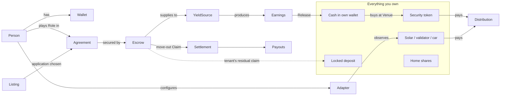

# Product ontology

The machine-readable source of truth is [`ontology.yaml`](ontology.yaml). This page explains it. When a concept changes, update both.

**Thesis.** Money and assets that everyday life forces people to lock away (rental deposits first) should keep working for their owner, without weakening the protection they exist for.

**Positioning (decided 2026-09-26).** A household-ownership app. Your verified identity is the root, and everything you own, rent or run attaches to it through adapters. The rental deposit is the first and most complete building block.

**Overview for people.** Start with [`LEDGER_OF_LIFE.md`](LEDGER_OF_LIFE.md): the five areas of one person's overview, the proposed app structure, and the adapter decision.

**Bigger picture.** Part of [Stadtstack](https://stadtstack.giraeffleaeffle.chatgpt.site): one verified identity, many contexts (tenancy, club, house community, city). Each context gives the person roles, a feed of what is decided, and what they own there. The tenancy is the first context that is built.

**The app in one sentence.** A home-centred app that shows everything you own. It secures rental deposits in escrows that earn, lets tenants claim and invest those earnings, and connects the other things a household owns that produce value.

## Six layers

| Layer | Question it answers | Concepts |
| --- | --- | --- |
| 1. Identity and contexts | Who is acting, with which keys, in which contexts, and what may they see? | Person, Wallet, IdentityAssurance, Credential, DisclosurePolicy, Context, Membership, CitySignal, MyPlaces |
| 2. Homes | Which home, which terms, who is involved? | Home, Listing, Application, Agreement, Role |
| 3. Custody | Where is the deposit, and who may move it? | Escrow, Operation, Claim, Settlement, Payout |
| 4. Earnings | What does the locked deposit earn? | YieldSource, Earnings, Release |
| 5. Ownership | What do I own and what does it pay me? | Asset, Position, Venue, Distribution, Adapter |
| 6. Vision | Where can this go? | CollateralDeposit, HomeEquityPath, DeviceTokenization |

Each layer builds on the ones below it. For example, an **Earnings Release** (4) requires an active **Escrow** (3), which requires an accepted **Agreement** (2) between verified **People** (1).

## Concept map



**City signals and private places.** Stadtstack publishes public, versioned **CitySignals** with
source locators, as-of time, review state, geometry precision and LLM faithfulness if applicable.
Compact city records drive the map and lists; clicking an item requests its full public record by
signal ID for source detail. They are read-only public data; `candidate` means **not yet
human-reviewed**, not fact-checked by the city. A **Person** may mark optional **MyPlaces**
home/work pins per city and select sport/kids/shops/health/culture interests, all kept only in that
device's localStorage. The person sees relevant CitySignals through ranking and matching entirely
in the browser (1 km near home; approximate 400 m straight-line home-to-work corridor). A city
switch uses only pins saved for that city. No pin, interest or route is sent to the app server;
map tiles do reveal the viewed area to OpenFreeMap. The fictional test fixture is an illustration,
never an app data source.

## Money flow of one tenancy

```mermaid
sequenceDiagram
  participant T as Tenant wallet
  participant E as Escrow
  participant Y as Lending
  participant L as Landlord
  T->>E: Deposit (one approval: fund + lend)
  E->>Y: Supply
  Y-->>E: Interest accrues
  E->>T: Claim earnings any time (only above the deposit)
  T->>T: Invest in stocks or home shares, which pay distributions
  L->>E: Move-out: propose deduction (0 allowed)
  T->>E: Agree and settle (or dispute; arbitrator decides)
  E->>T: Payout: deposit minus deduction
  E->>L: Payout: deduction
```

## Rules that must always hold

- **The deposit is protected.** The required security is never released as earnings. Only what it earns can be claimed.
- **Fixed recipients, pull payouts.** Money only goes to each party's canonical account, and a party that breaks its own account blocks only itself.
- **Roles come from contexts.** A listing's owner is its landlord; agreement parties grant tenancy roles, never onboarding choices or client state.
- **The tenant's portfolio is theirs.** Landlord and arbitrator have no authority beyond the escrow.
- **Adapters are read-only**, and their credentials stay on the server.
- **Privacy by predicates.** Others learn facts ("verified adult, income at least 3× rent"), not documents. No personal data goes on-chain, and identity is never linked to a wallet address on-chain.
- **Private local pins.** MyPlaces never leaves the device. Only public whole-city CitySignals are fetched; matching runs in the browser, not on the server.
- **Everything shown has a reality level** (below). Never present simulated or illustrative values as real.

## How real each part is (2026-09-26)

| Level | Meaning | What is at this level |
| --- | --- | --- |
| Live mainnet | Real assets | Nothing yet |
| Testnet, real | Real execution with test tokens | Accounts and wallets; listings and agreements; Solana escrow (setup, deposit, lending, claims, settlement, payouts); Robinhood escrow; tSPYx and test TSLA purchases |
| Testnet, simulated input | Real execution, one input faked on purpose | Deposit yield (Solana `test_credit_yield`, Robinhood test vault) and therefore earnings claims; tSPYx distributions |
| Read-only live | Real third-party data, with source and review caveats | CitySignals from Stadtstack public files (candidate items not yet reviewed); Home Assistant solar/savings and optional daily consumption reading; Gnosis, Ethereum and Solana validators; SPYx and TSLA reference prices |
| Self-declared local | Unverified information a person places on their device | MyPlaces home/work map pins, removable from localStorage; not a verified address |
| Prototype | A working test/counterpart exists but this is not a money-moving app flow | Stocks as deposit (`CollateralEscrow` testnet contract and calculator); service-charge example statement with server-stored test prepayment; Morpho on a mainnet fork |
| Illustration | Visual or researched lead only | Unverified local cooperative candidates (no offers); home shares and the home-token grid |
| Roadmap | Idea only | Home tokens toward owning a home; EU Digital Identity Wallet; EV adapter; tokenizing device income |

## Journeys

| Person | Steps |
| --- | --- |
| Tenant | Account → find a home → apply → accept → secure deposit → **claim earnings any time → invest** → move-out answer → payout |
| Landlord | Account → rent out a home → choose applicant → invite arbitrator → accept → create deposit space → propose deduction at move-out → payout |
| Arbitrator | Account → join by invitation → decide a dispute |
| Any owner | Connect adapters → see everything owned |

In each tenancy phase exactly one person has an action; everyone else sees what they are waiting for (`src/server/journey.ts`).

## Where concepts live in code

| Concept | Code |
| --- | --- |
| Person, Wallet | `src/wallets/`, `src/server/authenticated.ts` |
| Listing, Application | `src/server/listings.ts` |
| Agreement, Role | `src/server/agreements.ts` |
| Escrow (Solana) | `programs/rental_escrow/src/` |
| Escrow (Robinhood), CollateralDeposit | `contracts/evm/src/` |
| Operation, Release, Payout | `src/server/solana-service.ts`, `src/server/solana-initialization.ts` |
| Journey (next step per person) | `src/server/journey.ts`, `src/components/home.tsx` |
| Position, Venue, Distribution | `src/server/portfolio.ts`, `src/server/robinhood-demo.ts` |
| Adapter | `src/server/adapters.ts`, `src/components/assets.tsx` |
| CitySignal | `src/server/city-signals.ts`, `app/api/city-signals/route.ts`, `src/components/personal-map.tsx` |
| MyPlaces and on-device relevance | `src/components/personal-map.tsx`, `src/components/personal-map-relevance.ts` |
| Test tooling (never evidence) | `src/server/test-signer.ts`, `src/server/test-helpers.ts`, `scripts/` |

## Open design questions

1. **Name and positioning:** is this a deposit product with a portfolio, or a household-ownership app whose first adapter is the rental deposit?
2. **Home shares:** which issuer or legal wrapper (a Germany-compatible security), and is "down-payment credit" enough for the vision?
3. **Device income:** stay read-only, or pilot selling future solar or validator income (regulatory scope)?
4. **Identity:** EUDI Wallet (adult check and opt-in city are built against the EU test verifier; the current PID has no age flag, so the birth date is read and discarded) versus German eID via a provider. Banks must accept EUDI wallets for onboarding and strong authentication by December 2027. The EUDI framework offers selective disclosure (SD-JWT VC, mdoc) but no zero-knowledge proofs yet; income thresholds without revealing income need them.
5. **Mainnet path:** which network holds the first real deposit, and which yield source and stock venue are eligible there?
