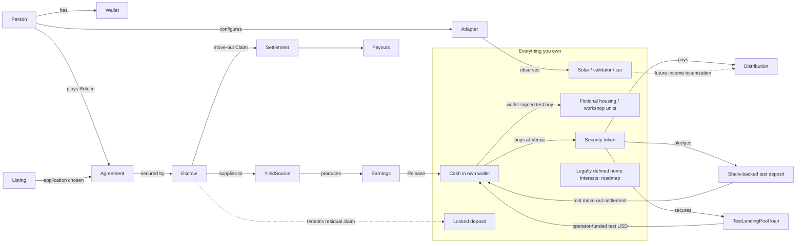

# Product ontology

The machine-readable source of truth is [`ontology.yaml`](ontology.yaml). This page explains it. When a concept changes, update both.

**Thesis.** Money and assets that everyday life forces people to lock away (rental deposits first) should keep working for their owner, without weakening the protection they exist for.

**Positioning (decided 2026-09-26).** A household-ownership app. Your verified identity is the root, and everything you own, rent or run attaches to it through adapters. The rental deposit is the first and most complete building block.

**Start here for people.** [`LEDGER_OF_LIFE.md`](LEDGER_OF_LIFE.md) describes the Today landing page, the signed-in areas and adapter choices; [`INFORMATION_ARCHITECTURE.md`](INFORMATION_ARCHITECTURE.md) states where each feature lives and how to place a new one.

**Bigger picture.** Part of [Stadtstack](https://stadtstack.giraeffleaeffle.chatgpt.site): one verified identity, many contexts (tenancy, club, house community, city). Each context gives the person roles, a feed of what is decided, and what they own there. The tenancy is the first context that is built.

**The app in one sentence.** A home-centred app that shows everything you own. It secures rental deposits in escrows that earn, lets tenants claim and invest those earnings, and connects the other things a household owns that produce value.

## Seven layers

| Layer | Question it answers | Concepts |
| --- | --- | --- |
| 1. Identity and contexts | Who is acting, in which context, and what may others learn? | Person, Wallet, IdentityAssurance, Credential, DisclosurePolicy, Context, Membership, CitySignal, MyPlaces, ArrivalGuide, ProjectFollow |
| 2. Homes | Which home, terms and parties? | Home, Listing, Application, Agreement, Role |
| 3. Custody | Who may move a deposit? | Escrow, Operation, Claim, Settlement, Payout, CollateralDeposit |
| 4. Earnings | What does it earn? | YieldSource, Earnings, Release |
| 5. Ownership | What do I own, owe and earn? | Asset, Position, BorrowAgainstShares, Venue, Distribution, Adapter |
| 6. Civic system | What was proposed, done or measured in this same place? | Organization, Project, Funding, Activity, Output, Outcome, Indicator, Scenario, RelationEvidence |
| 7. Vision | What could follow, subject to verification? | ServiceChargeAccount, HomeEquityPath, DeviceTokenization, LocalInvestment, LifeTimeline |

Financial custody still depends on identity, home and signed operations. The civic lens reuses the city Context and CitySignal rather than introducing a separate atlas or portfolio.

## Concept map



**City signals and private places.** Stadtstack publishes public, versioned **CitySignals** with
source locators, as-of time, review state, geometry precision and LLM faithfulness if applicable.
Compact city records drive the map and lists; clicking an item requests its full public record by
signal ID for source detail. They are read-only public data; `candidate` means **not yet
human-reviewed**, not fact-checked by the city. A **Person** may mark optional **MyPlaces**
home/work pins per city and select sport, kids, shops, health, culture, nature and volunteering
interests, all kept only in that device's localStorage. The person sees relevant CitySignals
through ranking and matching entirely in the browser (1 km near home; approximate 400 m
straight-line home-to-work corridor). A city switch uses only pins saved for that city. No pin,
interest or route is sent to the app server; map tiles do reveal the viewed area to OpenFreeMap.
The fictional test fixture is an illustration, never an app data source.

**Getting onboarded into a city.** An **ArrivalGuide** is a public, account-free page for a city,
meant to be handed over at registration as a link or QR code. It holds a sourced plan for the
first months (registration and services first, then the social steps), what is happening soon
(from the published city feed), the clubs, facilities and groups a newcomer can try, and the
organisations to ask. Every item cites a page that was read, with the date; only the city, the
district, the state, the federal government or a body they own makes a step official. An entry
whose source is inactive is dropped. The reader's situation and interests are kept on the device
(the interests are the same store as MyPlaces), highlight and order items but never hide one,
and are never sent to the server. It is a community guide, not an official city service.

**ProjectFollow is a private bookmark, not membership.** Following in Places links the authenticated
person on this device to a public target identified by city and either canonical researched-case
ID or exact signal ID; signals linked to a case share that case follow. First follow
reads all current full public linked records successfully before storing a baseline;
partial sources cannot be followed and already-visible changes are not new updates.
Later status/dates/evidence-review changes,
budget-description figures/explicit basis wording (not typed expenditure), meaningful published
next-step notes and structured sourced outputs/measurements create pending events
retained until individually acknowledged,
including when a newer event is read first. Missing individual facts are labelled no longer
stated, not zero/cancelled. 404/outages preserve prior snapshots and do not infer withdrawal
or delivery. Case-only evidence is an app research record, not live PDF monitoring. Today shows at most two
pending updates and opens the exact case/signal in Places; the rest remain reachable
there. No private follow list, pins or interests leave this browser; only public city/signal
IDs are requested. Browser data loss removes local follows and history.

**One place, three lenses.** Places keeps one Project/CitySignal identity across Map, Outcomes and Connections. MapLibre draws only published geometry; a plan polygon is not a built footprint or affected area. An **Organization** may receive **Funding**, perform an **Activity** and produce an **Output**; an **Outcome** needs an **Indicator** with baseline, follow-up and attribution. Each project's `outputs[]` separately records basis, source URL, locator and date (`null` if unknown), so Kulturpark's reported phase-one facilities do not become its planned phase-two opening. Its own evidence record names the missing benefit indicator, not an inferred failure or zero. Adopting a plan, scheduling an opening, MWp capacity or planned annual outlays do not establish quality-of-life gains, energy generation or tax revenue. Source review and geometry precision remain inspectable.

**Measured observation is not a proven benefit.** The historical Münster 2021 bus-priority trial
links sourced municipal steering, traffic-rule coordination, 500 m of reported bus-lane work,
Stadtwerke GPS samples and LK Argus evaluation. Whole-route north/east-bound mean bus running
time was 251 s in June 2019 versus 235 s in August–September 2021 (12 Monday–Saturday
days per window outside summer holidays, number of bus trips unspecified). The €60,000 trial forecast is distinct
from about €42,000 spent by year-end 2021 while work continued; funding source and final cost
are not established. The [official evaluation, PDF pp. 12, 125–141](https://www.stadt-muenster.de/fileadmin/user_upload/stadt-muenster/61_verkehrsplanung/pdf/verkehrsversuche2021_endbericht.pdf)
reports traffic tradeoffs and overlapping roadworks/trials; different years and no control route
prevent isolating a lane-caused benefit. Münster report route maps are source context, not verified
CitySignal geometry or an impact area. The other five case records keep their named missing
benefit indicators. Today can open the exact Münster case without altering chosen city/pins
only when Münster is the chosen city or a followed development explicitly makes it relevant;
everyone can find the historical example in Places.

**Relation evidence.** Solid means evidence-backed observation/report with its original status; proposed links identify a plan and do not inherit delivered status. Dashed means a modeled causal assumption in a fictional **Scenario**. Its allocation conserves capital as wages + local suppliers + external purchases + reserve; wages divided by assumed cost per job-year yields job-years, not permanent hires. Municipal receipts, transfers and service costs are editable *independent* assumptions; no investment→tax conversion, permanent employment, municipal retention of all tax, housing growth or causal improvement is inferred. Switching to observed hides this loop. Neither simulation nor public signals enter the personal Position/net-worth model.

## Money flow of one tenancy

```mermaid
sequenceDiagram
  participant T as Tenant wallet
  participant E as Escrow
  participant Y as Lending
  participant L as Landlord
  T->>E: Deposit (one approval: fund + lend)
  E->>Y: Supply
  Y-->>E: Interest accrues
  E->>T: Claim earnings any time (only above the deposit)
  T->>T: Invest in stocks or home shares, which pay distributions
  L->>E: Move-out: propose deduction (0 allowed)
  T->>E: Agree and settle (or dispute; arbitrator decides)
  E->>T: Payout: deposit minus deduction
  E->>L: Payout: deduction
```

## Rules that must always hold

- **The deposit is protected.** The required security is never released as earnings. Only what it earns can be claimed.
- **Fixed recipients, pull payouts.** Money only goes to each party's canonical account, and a party that breaks its own account blocks only itself.
- **Roles come from contexts.** A listing's owner is its landlord; agreement parties grant tenancy roles, never onboarding choices or client state.
- **A failed key lookup is not a failed identity.** Verify Privy ES256 signature, issuer, audience, session and expiry before provider user/wallet ownership checks. Invalid or foreign JWTs fail closed; if the public JWKS cannot be reached, report service unavailable rather than telling a valid person to sign in again. No anonymous or alternative-key fallback is allowed.
- **The tenant's portfolio is theirs.** Landlord and arbitrator have no authority beyond the escrow.
- **Passive observation is read-only; signed finance is not.** Home Assistant, validator and price adapters only read. Financial testnet actions use the existing user-authorized signing and Operation record; credentials remain server-side and the server never holds a person's wallet key.
- **A connection is not an asset or a health check.** The shared five-topic catalogue distinguishes source, maturity, environment, authority and saved state. A linked wallet does not establish funds; a saved validator ID does not prove stake ownership. Read failures stay unavailable, not unconfigured. Me is the one device-settings owner.
- **Privacy by predicates.** Others learn facts ("verified adult, income at least 3× rent"), not documents. No personal data goes on-chain, and identity is never linked to a wallet address on-chain.
- **Private local pins.** MyPlaces never leaves the device. Only public whole-city CitySignals are fetched; matching runs in the browser, not on the server.
- **Everything shown has a reality level** (below). Never present simulated or illustrative values as real.
- **Test units are not property rights.** `tHOME`/`tWORK` are distinct fixed-supply fictional issuers. The wallet holds actual test tokens, not a real company interest, membership or apartment. Issue price is not market value; these units stay outside the priced-asset subtotal.
- **Approval is not a purchase.** Local investing persists the exact reviewed/signed step before broadcast and requires canonical receipts and exact token effects. Ambiguous outcomes remain unresolved; no fresh nonce or replacement spend is silently signed.

## How real each part is (2026-09-28)

| Level | Meaning | What is at this level |
| --- | --- | --- |
| Live mainnet | Real assets | Nothing yet |
| Testnet, real | Real execution with test tokens or test verifier | Accounts and wallets; EU OpenID4VP adult/optional city presentation with confirmed iOS phone flow; listings and agreements; Solana and Robinhood test escrows; tSPYx and test TSLA purchases |
| Testnet, simulated input | Real testnet execution with an intentionally simulated price or yield | Deposit yield/earnings; tSPYx distributions; fake tTSLA pledge and share-backed test-USD loan; fictional `tHOME`/`tWORK` purchases at test issue prices. Real rights/returns are not implied. Legacy official test TSLA and Solana tSPYx remain separate assets. |
| Read-only live | Real third-party data, with source and review caveats | CitySignals from Stadtstack public files (candidate items not yet reviewed); Home Assistant solar/savings and optional daily consumption reading; Gnosis, Ethereum and Solana validators; SPYx and TSLA reference prices |
| Self-declared local | Unverified information a person places on their device | MyPlaces home/work map pins, removable from localStorage; not a verified address |
| Self-declared private | Unverified information stored under the person's authenticated account | Earlier places in the partly built life timeline; no residence verification or disclosure to other contexts |
| Prototype | A working test/counterpart exists but this is not a money-moving app flow | Standalone stock-collateral calculator; service-charge example statement with server-stored test prepayment; Morpho on a mainnet fork |
| Illustration | Fictional physical/economic model or researched lead; not a measured outcome | Building technology switches, hypothetical workshop→housing relationship and city flywheel; municipal scenarios and unverified real cooperative leads |
| Roadmap | Idea only | Home tokens toward owning a home; production EUDI issuance/integration; bank-account adapter; EV adapter; tokenizing device income |

## Journeys

| Person | Steps |
| --- | --- |
| Tenant | Account → find a home → apply → accept → secure deposit → **claim earnings any time → invest** → move-out answer → payout |
| Landlord | Account → rent out a home → choose applicant → invite arbitrator → accept → create deposit space → propose deduction at move-out → payout |
| Arbitrator | Account → join by invitation → decide a dispute |
| Any owner | Connect adapters → see everything owned |
| Local owner/customer | Available shares → separately signed collateral and loan → housing/company units → an owned local AI answer and checked x402 receipt; free library access is an independent visitor service |

In each tenancy phase exactly one person has an action; everyone else sees what they are waiting for (`src/server/journey.ts`).

Local inference is an owned, immutable **LocalInferenceRequest**, not a city fact or a
financial recommendation. A paired outbound **InferenceHost** (or the configured direct
local Ollama endpoint) produces actual answers and reports usage. The quote binds the host
and its verified payout wallet. Own-host-only is the default; routing to city hosts requires
marking the question public. The host reads the question in clear, and neither a signature
nor a model label proves which model ran or whether the host retained a copy.
An **InferencePayment** uses official x402 v2 exact/Permit2 and existing tUSDG; a finite
allowance is not a completed payment. The result is saved before settlement, failed/incomplete
inference is not charged, and canonical token effects establish revenue. A free library
visitor has a separate revocable session, bounded attempts and no fabricated sponsor receipt.
The **HostEconomicsScenario** is an editable euro calculation, not actual profit or a conversion
of test receipts.
An **InferenceHost** is paired by a ten-minute single-use public-key-bound code, approved
by an operator-allowlisted account, and authenticated by Ed25519 request signatures with
clock and replay checks. Its private key and optional Home Assistant wake token stay on
the LAN connector. The server never connects into that LAN. Heartbeats distinguish online,
asleep and offline; one lease allows only the assigned host to answer a bounded text-only
job. Failed or timed-out jobs are not charged. The single-replica queue holds question copies
only in memory, erased on completion, timeout, revocation or process exit.


## Where concepts live in code

| Concept | Code |
| --- | --- |
| Person, Wallet | `src/wallets/`, `src/server/authenticated.ts` |
| Listing, Application | `src/server/listings.ts` |
| Agreement, Role | `src/server/agreements.ts` |
| Escrow (Solana) | `programs/rental_escrow/src/` |
| CollateralDeposit | `contracts/evm/src/CollateralEscrow.sol`, `src/server/share-workflows.ts`, `src/components/share-workflows.tsx` |
| BorrowAgainstShares | `contracts/evm/src/testnet/TestLendingPool.sol`, `src/server/share-workflows.ts`, `src/components/share-workflows.tsx` |
| Operation, Release, Payout | `src/server/solana-service.ts`, `src/server/solana-initialization.ts` |
| Journey (next step per person) | `src/server/journey.ts`, `src/components/home.tsx` |
| Position, Venue, Distribution | `src/server/portfolio.ts`, `src/server/robinhood-demo.ts` |
| LocalInvestment (test units) | `src/data/local-investments.ts`, `src/server/local-investments.ts`, `src/components/local-investments.tsx`, `contracts/evm/src/testnet/FictionalCityUnit.sol`, `contracts/evm/script/local-investments.mjs` |
| Building/city scenario | `src/components/city-flywheel.tsx`; physical systems, supplier relationship, jobs and fiscal effects are illustrative |
| LocalInferenceRequest and visitor access | `src/server/local-ai.ts`, `src/server/local-ai-runtime.ts`, `src/server/local-ai-session.ts`, `src/components/local-ai.tsx`, `app/(wallet)/library/page.tsx` |
| InferencePayment | `src/server/local-ai-payment.ts`, `src/server/local-ai-operations.ts`, `src/wallets/inference-signing.ts`; explicit Permit2 review, owner/nonce binding and dedicated fee account |
| InferenceHost | `src/server/local-ai-hosts.ts`, `app/api/local-ai/hosts/`, `host-connector/connector.mjs`, `src/components/local-ai-host.tsx`; outbound-only connector, invited pairing, signed jobs and heartbeat status |
| HostEconomicsScenario | `src/components/local-ai-economics.ts`, `src/components/local-ai-host.tsx`; euro assumptions separate from measured usage and settled test-token receipts |
| Adapter catalogue, state and settings | `src/data/ledger-catalogue.ts`, `src/components/ledger-adapter-state.ts`, `src/components/ledger-adapters.tsx`, `src/components/adapter-settings.tsx`, `app/api/adapters/route.ts` |
| Adapter observations (home solar, validator) | `src/server/adapters.ts`, `src/components/device-readings.tsx`, `app/api/assets/route.ts` (`?area=devices`); existing financial and public-data readers retain their own contracts |
| Placement: areas, Money sections, jump targets | `src/components/areas.ts`, `src/components/section-tabs.tsx`, `src/data/sections.ts`, `src/components/reality-chip.tsx`; rule in `INFORMATION_ARCHITECTURE.md` |
| LifeTimeline | `src/server/timeline.ts`, `src/components/me.tsx`; app tenancy entries and private self-declarations are built, wider milestones/disclosures planned |
| CitySignal | `src/server/city-signals.ts`, `app/api/city-signals/route.ts`, `src/components/personal-map.tsx` |
| CityEvent and sourced Organization profiles | `stadtstack-data/src/event-venues.ts`, `src/components/city-feed.tsx`, `src/data/cities/strausberg-organizations.ts`, `src/components/organization-profile.tsx`; event time/location provenance and attributed public participation, not issuer affiliation |
| MyPlaces and on-device relevance | `src/components/personal-map.tsx`, `src/components/personal-map-relevance.ts` |
| ArrivalGuide | `src/data/arrival/`, `src/data/interests.ts`, `src/components/arrival-guide.tsx`, `src/components/arrival-logic.ts`, `src/server/welcome-feed.ts`, `app/welcome/[city]/page.tsx` |
| ProjectFollow | `src/components/project-following.ts`, `src/components/use-project-following.ts`, `src/components/project-follow-button.tsx`, `src/components/civic-place-lenses.tsx`, `src/components/today.tsx` |
| Test tooling (never evidence) | `src/server/test-signer.ts`, `src/server/test-helpers.ts`, `scripts/` |

## Open design questions

1. **Home shares:** which issuer or legal wrapper (a Germany-compatible security), and is "down-payment credit" enough for the vision?
2. **Device income:** stay read-only, or pilot selling future solar or validator income (regulatory scope)?
3. **Identity:** EUDI Wallet (adult check and opt-in city are built against the EU test verifier; the current PID has no age flag, so the birth date is read and discarded) versus German eID via a provider. Banks must accept EUDI wallets for onboarding and strong authentication by December 2027. The EUDI framework offers selective disclosure (SD-JWT VC, mdoc) but no zero-knowledge proofs yet; income thresholds without revealing income need them.
4. **Mainnet path:** which network holds the first real deposit, and which yield source and stock venue are eligible there?
