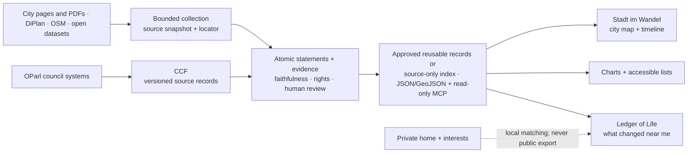

# City information people can understand — Stadtstack × Ledger of Life

*Vision alignment for the product owner · 26 September 2026. A proposal, not a claim that the full pipeline exists.*

## 1. What we understand you want

You are not asking for another list of links to city websites.
You want a person to look at a place and understand what may change there, what has happened, what comes next, and what nobody yet knows.
A map should make long plans and council papers tangible, with a short timeline, plain words, and evidence that can be checked.
Someone who cannot or does not want to use the map should be able to get the same answer in a clear list or chart.
The information should be collected once, checked and corrected when it changes, then made available for others to use where rights allow.
Ledger of Life should bring that public picture home: show the person's own home alongside nearby projects, decisions, clubs, shops and services relevant to them.
Their exact address and interests must remain private, even while the city information is public.
Strausberg already shows why this matters, but the first lasting data pilot must be somewhere the sources can lawfully be reused and kept up to date.

## 2. One picture

A useful first encounter is a project card that says **“Last source check: 5 September; comment period ended 20 September; next council date: not established”** rather than another link to a 65-page PDF. This is what Stadtstack’s *understand → decide → act* cycle should feel like from a person’s front door.

In Stadtstack terms, collection is shared infrastructure, review makes city changes understandable, CCF reveals formal deliberation, and verified milestones show what was actually done. Rights, corrections and lessons between cities run across all four levels.

## 3. Who owns what, and the small shared contract

| Component | Existing base → intended responsibility |
|---|---|
| Collector beside the atlas | The atlas already has bounded source-cache scripts and a hash/time manifest; use APIs/export first, then a VM browser for hard web pages/PDFs. It proposes evidence and statements, never publishes itself. A scheduled collector is **not built**. |
| CCF, separate repository | Four verified OParl councils (Köln, Münster, Wuppertal, Castrop-Rauxel); Git-versioned meeting/paper source records and deletion/modified markers, **not** an MCP or a Strausberg feed. Keep its source ID/type and derive jurisdiction from the data path; do not turn a meeting agenda into an adopted decision. |
| Stadtstack atlas | Existing human-curated project interpretation, public research-preview read model (`atlas-city-read-model-v1`) and geometry (`project-atlas-map-v1`), timelines, uncertain status/next step and locations. An editor owns project matching, claims, spatial precision, review and corrections; retain these interfaces as consumers already read them. |
| Open-data + MCP publisher | **Proposed thin, read-only outlet over the reviewed atlas records**, not another source of truth. Offer downloads/index and searches with the same IDs, provenance and caveats; don't label the present research preview as licensed, municipally approved open data. |
| Ledger of Life | Its Places view already reads the atlas project/consultation summary and has its own OSM clubs feed. **Proposed** private home map and “what changed near me”; consumes public city facts but never collects or exports a resident's location, interests or wallet identity as city data. |

One published **assertion** (not a whole PDF or a council record forced into a project) needs: `id` and `version`, `jurisdictionId`, `kind` (`project_milestone|council_record|place`), `extractedStatement`, `sourceUrl`, exact `locator` (PDF page/section or HTML/API field), source hash and retrieved time, `faithfulnessScore` plus evaluator/reason (nullable for directly checked structured fields), `reviewState` and reviewer/time, `licence`/reuse status and attribution, `geometry` with origin and precision (or null), and `asOf` plus event date versus scheduled date. A project links several assertions and sources; an OParl paper stays a council source record until a reviewed link to a project is established. Source corrections invalidate dependent assertions and the published version; a withdrawn claim stays in the correction history. Coverage is explicit: a blank area never means no project exists.

**Present reality:** Strausberg atlas has 24 draft projects, 23 mapped points and five DiPlan procedure areas, all `pending_review` and not a full inventory as of 5 September 2026; four jurisdictions exist in the prototype. Its selected OSM everyday-place layer has 121 of 298 indexed places, no observation date or verified operating status; it is not a clubs directory. The wider Ledger OSM clubs feed exists separately. [Atlas interface research](research/STADTSTACK_ATLAS_AND_CCF_INTERFACES.md).

## 4. Collect, check, publish — only then tell the visual story

**Collection.** Start at a city's official planning and works indexes, its dated notices, DiPlan/open geodata and documented APIs. In cities with a verified OParl endpoint, import CCF's public council records; let OSM supply labelled background places, not official opening hours. For a changed source, a sandboxed VM/browser can render a JavaScript page or scanned PDF, capture the original bytes/hash, page image/text, URL and retrieval time, then propose short claims; human reviewers inspect OCR and the visible page. Reuse the atlas's existing manifest/caching before adding a scheduler; proposed checks are daily during active consultations and weekly otherwise, with conditional fetches for changes. Never interpret a fetch failure as project cancellation. Respect robots and site terms, use a descriptive user-agent, bounded rate/concurrency and no login/captcha bypass; isolate untrusted page instructions from agent tools. Social posts may later identify leads but cannot alone certify a public decision.

**Evaluation.** For each factual statement, compare only its exact source excerpt with the proposed wording using DeepEval faithfulness (`actual_output` against `retrieval_context`), record the score and reason, and require a positive passage match. Its LLM judge tests non-contradiction and cannot establish truth, completeness, permission, geometry or whether the source has since changed. Calibrate a threshold on a few human-labelled German planning examples; a passing score **queues review, never automatically publishes**. An editor checks deadlines, planned versus completed work, who decides/implements, source date, location precision, rights and redactions; high-impact council or construction claims require explicit approval. Use states `candidate → pending_review → approved → superseded/withdrawn` and propagate corrections to map, chart, MCP and Ledger. Direct OParl fields need type/source checks, not an invented LLM score.

**Open data and MCP.** Publish rights-cleared, reviewed records with dataset-specific attribution as versioned JSON/GeoJSON (CSV for charts), a concise schema, as-of/coverage and correction links; a catalogue can list source metadata and outbound URLs when full redistribution is not cleared. Publicly viewable PDFs are not automatically openly licensed: Strausberg's PDF/DiPlan geometry reuse needs checking; OSM-derived datasets must retain ODbL attribution/obligations. Read-only tools mirror the same published data: `search_projects_near` (public geometry, bounded radius, explicit precision), `list_council_decisions` (only *confirmed* decisions; otherwise return paper/meeting records as such), `get_sources` (exact locators, rights, version), and `get_changes`. No home coordinate or interest profile in MCP, public logs or exports. Berlin ODIS shows what a CKAN/WFS discovery MCP can do; Datawrapper-like charts are **an alternative view**, not a second authority or proof of complete coverage. [ODIS](https://odis-berlin.de/aktuelles/2026-06-29-mcp-server/) · [DeepEval](https://deepeval.com/docs/metrics-faithfulness).

## 5. Ledger's private personal map

The resident optionally marks their home on an OSM-backed map, overlays reviewed nearby projects and public council records (with a separate “nearby, not necessarily affecting your street” explanation), and can turn on clubs, shops, health and public-service layers. A “what changed near me” card compares dated public versions; each place/project opens a plain-language timeline with next step, uncertainty, exact source and an equivalent text list. Clubs and shops are contributed OSM entries, not a vetted operating directory or confirmed partner offers. Participation links lead to the official window only while it is open; the app does not pretend to submit a formal comment. Matching against broad public city data happens on the device initially. Exact home coordinates, interests and wallet claims never enter public records or CCF; avoid third-party geocoding/tile requests that reveal a private home, and require separate opt-in and retention terms for any future server-side alerts. Public city browsing does not require a wallet.

## 6. Pilot city: choose the story honestly

**Recommendation: Strausberg for the hackathon's visual/resident pilot; Berlin as the fallback first *public open-data* pilot if Strausberg reuse cannot be cleared.** The atlas and Ledger connection already exist and turn municipal PDFs into a strong before/after. Strausberg **does publish useful material**: the standalone [2025/26 budget ordinance, §1 PDF page 1](https://www.stadt-strausberg.de/wp-content/uploads/2025/04/2024-11-07_Haushaltssatzung_2025_2026.pdf) states *planned* investment outlays of €17,941,270 (2025) and €12,609,320 (2026). Extracting and charting that distinction is valuable; it is **not** proof money was spent or tied to a given project. The complete detailed plan was not found online and is offered for inspection, no Strausberg OParl endpoint is confirmed, and the municipal source reuse licence is unknown [budget research](research/CITY_BUDGET_DATA_STRAUSBERG_BRANDENBURG.md). The atlas's existing 24 projects are still editorial drafts.

Berlin has a [planning-procedure WFS dataset](https://daten.berlin.de/datensaetze/bebauungsplanverfahren-in-berlin-wfs-4f574ea7) whose portal explicitly states `dl-de-zero-2.0`, and an existing dataset-discovery MCP; check live WFS freshness/coverage before selection because its portal says “updated 2004,” and polygons alone do not give next steps. Münster is a better *later* test for CCF council ingestion, not a Strausberg decision feed. This separates quickest visual proof from legally reusable scaling rather than pretending one city solves both.

## 7. Smallest end-to-end hackathon slice; then scale

Take **one Strausberg planning PDF** (Altstadt Quartier), preserve its URL/hash/page locator, extract one or two checkable statements, score and visibly review them, then link an already sourced/precision-labelled atlas point. The published consultation ended **20 September 2026**; on **26 September** the display must say “window closed; next decision date unknown,” not “you can still comment” or “building underway.” From **one reviewed, rights-eligible record**, show the same ID, date and uncertainty in the atlas map/timeline, a read-only `get_sources`/`search_projects_near` MCP response and Ledger's private-home-neighbourhood card (using a clearly fictional/local home for the demo); give a small JSON/GeoJSON download. Verify the three views and MCP show a source correction or changed date consistently. If PDF/geometry reuse is **not** cleared, keep the whole record and MCP demonstration local/private, expose only permissible source-index links publicly, and use a verified licensed source for any public open-data output; do not call the PDF extraction an open-data release.

After that: schedule and measure collection, secure source reuse/reviewer roles, add CCF records in a verified OParl city with explicit decision/project links, publish reviewed bulk exports, expand the OSM facility selection to checked clubs, then add opt-in personal change alerts and Datawrapper-style charts. Budget *headline plan* charts can follow once rights, reference years and planned-versus-actual labelling are settled; detailed city spending cannot be invented from the ordinance.

## 8. What the two review passes sharpened; decisions for you

Astra's first pass rightly insisted on visual understanding, CCF source/derived separation and personal-location privacy; I disagreed with its arbitrary numerical faithfulness threshold, an upfront second-city council dependency and a budget chart in the smallest visual proof. Round 2 accepted those changes and anchored the design in the existing atlas and OSM layer. I accepted Astra's primary-source correction: Strausberg's standalone ordinance **does** contain planned headline figures, even though the detailed budget plan was not found online. We agree that unknown licence and pending editorial review prevent claiming today's atlas is already a municipally certified open-data feed. [Round 1](vision/astra-round1.md) · [Round 2](vision/astra-round2.md)

1. Is the first success a resident understanding one changing Strausberg place, or a legally reusable multi-city feed from day one?
2. Will you seek limited source/reuse and review agreement with Strausberg, or use only already openly licensed material for public publication?
3. Which first personal example matters most: planning milestone, confirmed council decision, or a useful everyday place—and how should “nearby” be explained?
4. Who can approve, challenge or retract a project's status and location, and how quickly must corrections appear everywhere?
5. Must the exact home location and interests always stay on-device, or may a person separately opt into private server-side matching/alerts?
