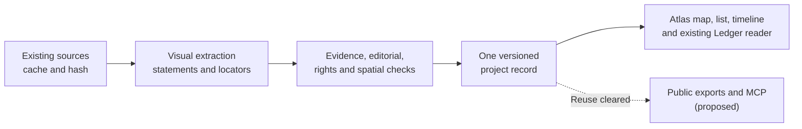

# Astra · Round 2

> Revised read-only draft after critique and the committed interface research. The final owner-facing synthesis is [`VISION_CITY_DATA.md`](../VISION_CITY_DATA.md).

I want people to understand what is changing around them. A resident should recognise a familiar place on a map and feel that a 65-page planning PDF has become understandable. They should see what is proposed, what has happened and when the evidence was checked. A date should tell them whether a published participation window has ended. The next step should be visible, with an unknown date shown as unknown. An equivalent readable list should tell the same story. Each factual statement should lead back to its evidence. Over time, this understanding should help people participate in decisions and connect their neighbourhood with their own lives.

**Recommendation:** make Altstadt Quartier in Strausberg the single hackathon story. Prove the journey from existing documents to a comprehensible, dated map entry and readable list. Use the existing atlas, its source collection and Ledger reader as the foundation.

**Present state, checked against the committed research and repositories on 26 September 2026:**

| Part | What exists and what remains unbuilt |
|---|---|
| Atlas | A Vinext prototype with **35 curated projects across four jurisdiction scopes**. Strausberg has **24 projects, 23 locations and five procedure polygons**, with a source snapshot dated **5 September 2026**. Coverage is incomplete; records remain `pending_review`, and the map is a `research_preview`. The reviewed public projection is not wired. |
| Collection and interfaces | Source caching, retrieval metadata and hashes already exist, alongside **v1 city read-model and map APIs**. These are the starting point. There is no automatic review/publication pipeline, atlas MCP server, DCAT catalogue or verified general reuse licence. |
| Everyday places | The existing layer contains **121 selected OSM places from 298 directory entries**. It carries ODbL attribution, but `observedAt` is null and operating status is unknown throughout. These are selected contributed locations, not a complete or currently verified service directory. |
| Ledger | Its reader already consumes atlas project and consultation summaries. A personal map, home pin, interest matching and a genuine “changed since your last visit” feed remain proposals. |

These distinctions come from the [interfaces research](/Users/max/Code/rental-deposit-hackathon/docs/research/STADTSTACK_ATLAS_AND_CCF_INTERFACES.md), [atlas brief](/Users/max/Code/strausberg-project-atlas/research/PROJECT_BRIEF.md), [facilities dataset](/Users/max/Code/strausberg-project-atlas/data/facilities-strausberg.json) and [Ledger reader](/Users/max/Code/rental-deposit-hackathon/src/server/city.ts).

**Existing PDFs already contain useful evidence.** Strausberg’s standalone 2025/26 budget ordinance, page 1, §1, prints planned investment outflows of **€17,941,270 for 2025** and **€12,609,320 for 2026**. Visual inspection confirms the row and year columns. These are headline plan figures from the ordinance dated 7 November 2024; they do not establish actual spending, project allocations or the latest amended position. [Official ordinance](https://www.stadt-strausberg.de/wp-content/uploads/2025/04/2024-11-07_Haushaltssatzung_2025_2026.pdf)

The detailed plan remains inspection-only in the documented access route; an online detailed dataset and its reuse licence remain unverified. The product opportunity is therefore to make **already published material understandable**, while identifying what is still missing. The budget illustrates that opportunity; it stays outside the smallest hackathon slice.

**Proposed flow:** assemble one reviewed story around the existing atlas. The first run can be manual; automation is a later improvement.

**The smallest end-to-end slice would do four things.**

1. **Refresh one project from its evidence.** Reuse the collector and source manifest for Altstadt Quartier’s planning explanation, official notice and location evidence. Extract a handful of statements with exact locators. The planning notice’s incomplete text extraction makes page rendering, OCR where needed and visual checking essential.

2. **Turn those statements into one understandable story.** The official notice records approval of the draft for public display on **2 July 2026**, followed by a published comment window of **17 August–20 September 2026**. On **26 September**, that window has ended. The old `consultation` stage label must not keep participation visibly open. [Official notice, page 1](https://www.stadt-strausberg.de/wp-content/uploads/2026/08/20260702_Bekanntmachung-Offenlage-BP67-22.pdf)

   Proposed resident wording:

   > **Altstadt Quartier — planning proposal** 
   > Published comment window ended: **20 September 2026**. 
   > Next council action and date: **not established by the inspected evidence**. 
   > Construction start and completion: **unknown**. 
   > Source snapshot: **5 September 2026**; published deadline evaluated on **26 September 2026**.

   Any refreshed evidence receives its own check date. Approval for public display does not establish adoption of the plan or the start of construction.

3. **Show the same story on the existing map and an accessible list.** Include a short timeline, next-step field, unknowns and source links. Reuse the everyday-place layer as optional context, retaining its coverage and freshness caveats. Distinguish a procedure boundary from an approximate marker; proximity alone cannot establish that a project affects someone’s street or home. Existing 3D buildings remain context, without implying a future building design.

4. **Carry one reviewed revision through the existing views.** Wire the selected record into the compatible v1 outputs and Ledger reader, retaining its ID, version, evidence and review labels. Demonstrate the correction from the expired participation wording to the dated explanation above. Label a staged replay as a replay. Keep preview status visible until the reviewed output path is actually connected.

**Proposed evidence standard:** every atomic factual statement needs positive source support and a precise locator. Preserve the source URL, captured version/hash, relevant passage or structured field, and page/section/table location. Separate what the source states from our calculations and interpretations. Check OCR, dates, negation, units and column alignment against the page.

DeepEval’s documented LLM mode assesses alignment with supplied context and explicitly uses non-contradiction when classifying claims. Its score and explanation do not establish source truth, completeness, freshness or reuse rights. [Faithfulness documentation](https://deepeval.com/docs/metrics-faithfulness)

Calibrate any threshold against human-labelled examples, including expired deadlines, scanned notices and proposed versus adopted decisions. **A passing result only queues editorial review**, followed by the required rights and spatial checks. Every displayed pilot claim should have a recorded reviewer and review date; editorial review remains distinct from municipal confirmation. Changed evidence should trigger review of dependent statements and views.

**Public access and public reuse are separate gates.** For this pilot, unresolved Strausberg PDF rights mean a **local, explicitly non-open demonstration**, with only a checked public source index and links. Neither downloadable PDFs nor our summaries automatically qualify as openly reusable data. Assess derived datasets, database rights, geometry terms and personal data as well as copied text. The OSM layer’s ODbL terms and attribution remain attached to that layer; they do not clear municipal documents.

Once a specific output is cleared, publish that version with its evidence, licence, coverage and correction history, then expose the same eligible records through a minimal read-only MCP interface. Exports and MCP are proposed extensions, not existing atlas capabilities.

**Berlin is the conditional open-data pilot.** If openly redistributable official data is required and Strausberg’s reuse basis remains unresolved, use Berlin for that separate pilot, subject to checking the actual service and selected resource. Berlin’s official planning-procedures WFS catalogue declares **dl-de-zero-2.0**. Its “updated” field says **2004**, while metadata changed in **2026**; neither establishes current service freshness. A procedure polygon also does not supply a complete project history or next step. [Berlin dataset metadata](https://daten.berlin.de/datensaetze/bebauungsplanverfahren-in-berlin-wfs-4f574ea7)

The committed research identifies Berlin ODIS MCP as dataset discovery and CKAN/WFS access, with Datawrapper visualization handled separately. It is a useful reference, not an existing city-project story feed.

**Council integration comes later.** The CCF research verifies Köln, Münster, Wuppertal and Castrop-Rauxel. Git consumption and source correction history are wired; REST/MCP are planned, and no Strausberg OParl connection is proven. Münster can test a bounded council import after the Strausberg visual story works. Preserve CCF’s structured fields, upstream IDs, jurisdiction from the storage path, versions and deletions. A paper or agenda item becomes an adopted-decision milestone only when explicit evidence supports that interpretation. [CCF findings](/Users/max/Code/rental-deposit-hackathon/docs/research/STADTSTACK_ATLAS_AND_CCF_INTERFACES.md)

**Ledger’s personal view remains a proposal.** Start with a chosen neighbourhood and local matching. Exact home coordinates and interests stay private and do not enter public MCP, exports, logs or LLM queries. Tile and geocoding requests must also avoid leaking that context; shared views omit it. Public city browsing should require no identity verification. Later charts need equivalent readable data and visible coverage limits.

Success means a resident can explain **what is proposed, which date matters, what happens next or remains unknown, and where the evidence is**. The map, list and Ledger should agree after a correction.

**Changed after round 1:** the opening now foregrounds resident comprehension; the plan starts from the actual atlas and facility layer; the arbitrary 0.95 threshold is removed; the expired consultation is explicit; Strausberg is the sole hackathon city; and the budget chart and upfront Münster dependency are removed. The ordinance now demonstrates the value of extracting existing PDFs, while public redistribution has an explicit permission gate.

**Questions for the owner:**

- Is explaining this one project in a minute, including its unknowns, the first success criterion?
- Who owns pilot claim review and corrections, and which statements require municipal confirmation?
- Must the hackathon deliver openly redistributable official data, or may Strausberg remain an explicitly local proof while reuse rights are resolved?

*Read-only revision; no files were edited.*
